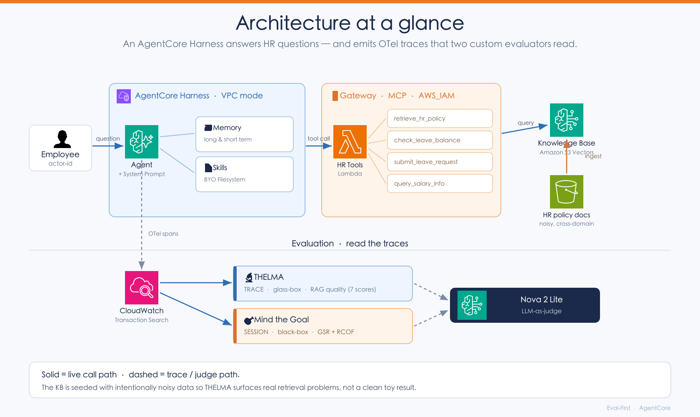

<div align="center">

# 🧪 Eval-First: Enterprise Agents with Amazon Bedrock AgentCore

**Build a realistic enterprise HR Q&A agent — then _measure_ its quality with code-based evaluators instead of eyeballing answers.**

<br/>


**English** | [简体中文](README.zh-CN.md)

</div>

---

> [!NOTE]
> This is the hands-on sample for the **"Eval-First: Building Enterprise Agents with AgentCore"** workshop.
> It is **self-contained** — it ships the CloudFormation template (`cfn/workshop-infra.yaml`),
> the Knowledge Base tooling (`knowledge-base/`), the HR Tools Lambda (`lambda/`), the Gateway
> tooling (`gateway/`), and both custom evaluators (`evaluators/`). Running the scripts in order
> builds the entire system from scratch in **your own account**.

> [!IMPORTANT]
> **Follow this README top to bottom.** Each step lists what it does, what it needs, and what it
> produces. Run the scripts **in the numbered order** — each one prints `Next: ...` pointing at the
> following step.

---

## 📑 Table of contents

1. [What this builds — and why](#1-what-this-builds--and-why)
2. [Architecture at a glance](#-architecture-at-a-glance)
3. [The eval-first loop](#-the-eval-first-loop-adlc)
4. [How this maps to the eval-first methodology](#-how-this-maps-to-the-eval-first-methodology)
5. [Prerequisites](#2-prerequisites)
6. [Execution order at a glance](#3-execution-order-at-a-glance)
7. [Step-by-step](#4-step-by-step)
8. [Optional labs](#-optional-labs)
9. [Cleanup](#5-cleanup--99-cleanupsh)
10. [Data sources & attribution](#6-data-sources--attribution)

---

## 1. What this builds — and why

This sample is **eval-first**: the whole point is to stand up a realistic enterprise agent and then
**measure its quality with code-based evaluators**, rather than eyeballing a few answers. The scripts
build an HR Q&A agent (Knowledge Base + Gateway tools + Memory on Amazon Bedrock AgentCore), run it to
produce traces, and then score those traces with two custom evaluators.

The two evaluators are the heart of the sample. They live in `evaluators/` and are independent
re-implementations of **published research methods** (not AWS products), wired to run on Amazon
Bedrock AgentCore:

### 🔬 `thelma_eval/` — single-turn RAG quality (THELMA)

Runs at **`TRACE`** level (the *glass-box* granularity — it inspects one execution trace).
Decomposes one Q&A into `(question, retrieved sources, answer)`. The THELMA paper defines **6
metrics**; our implementation reports **Source Precision as two separate scores** (chunk-level vs.
fact-level), so you'll see **7 numbers** per trace (all 0–1):

| Metric | Name | Question it answers |
|:------:|------|---------------------|
| **SP1** | Source Precision (chunk) | Are the retrieved **chunks** relevant as a whole? |
| **SP2** | Source Precision (fact)  | Of the **facts inside** those chunks, how many are actually relevant? |
| **SQC** | Source Query Coverage   | Do the sources cover the question? |
| **RP**  | Response Precision      | Is the answer on-topic? |
| **RQC** | Response Query Coverage | Is the question fully answered? |
| **SD**  | Self-Distinctness       | No internal repetition? |
| 🎯 **GR** | **Groundedness** | **Is every sentence backed by a source? (no hallucination, pass ≥ 0.7)** |

Its real value is **diagnosis** — the *interplay* of these scores points at which RAG component to fix
(retriever vs. prompt vs. source docs). The SP1/SP2 split is the key example: a **high SP1 with a low
SP2** means the chunk looks on-topic but most of the *facts* it carries are noise — exactly the symptom
of dirty data mixed into the source documents.


### 🎯 `mtg_eval/` — multi-turn goal success (Mind the Goal)

Runs at **`SESSION`** level (the *black-box* granularity — end-to-end goal outcome) in three steps:
**segment goals** (merge turns about the same thing), **judge success/failure** (a goal fails if any
turn fails), then compute **GSR** = *Goal Success Rate* (successful goals ÷ total goals, pass ≥ 80%) and
attribute each failure via **RCOF** = *Root Cause of Failure* (7-category defect taxonomy). Answers
*"did the agent actually accomplish what the user came for?"*

> [!NOTE]
> The **TRACE → glass-box** and **SESSION → black-box** mapping is deliberate: AgentCore's
> session / trace / span levels line up with the three evaluation granularities (black-box / glass-box
> / white-box) from the companion white paper. These two evaluators are **custom L2 evaluators**
> (calibrated LLM-as-a-judge) in that framework — see [below](#-how-this-maps-to-the-eval-first-methodology).

Both use judge model `us.amazon.nova-2-lite-v1:0`. Each evaluator bundles its algorithm, an **adapter
layer** (ADOT span → evaluator input), and a Lambda handler.

> [!TIP]
> See **[`evaluators/README.md`](evaluators/README.md)** for the full metric definitions, the THELMA
> diagnosis table, paper citations, and licensing.

To make the evaluation meaningful, the Knowledge Base is seeded with **intentionally noisy,
cross-domain data** (see [§6](#6-data-sources--attribution)) — so the THELMA scores surface real
retrieval-quality problems instead of a clean toy result.

---

## 🏗️ Architecture at a glance

The agent runs as an AgentCore **Harness** in VPC mode. Every invoke pulls Memory + Skills into
context, calls HR tools through the **Gateway** (MCP), and emits OTel trace spans that flow to
CloudWatch — where the two evaluators read them.



> Solid lines are the live call path; dashed lines are trace/judge flow.

---

## 🔁 The eval-first loop (ADLC)

The workshop closes the **Agent Development Life Cycle**: build, run, trace, evaluate, _diagnose_, then
optimize — and prove the fix with a re-evaluation.


> [!TIP]
> The payoff is the contrast: a prompt change improves grounding where retrieval is good, but **can't**
> fix a question whose retrieval failed (`SP2≈0`). That contrast is exactly how THELMA distinguishes
> *"fix the Prompt"* from *"fix retrieval."*

---

## 🧭 How this maps to the eval-first methodology

This sample is the **hands-on companion** to a four-part white paper on production-grade enterprise
agents. Where the white paper gives the *why* and the framework, this repo lets you run it end to end.
The mapping:

| White-paper concept | What you run here |
|---------------------|-------------------|
| **ADLC** — the build → run → trace → evaluate → diagnose → optimize flywheel | The whole script sequence; `10-optimize-prompt.sh` closes the loop |
| **Three evaluation granularities** — black-box / glass-box / white-box, aligned to AgentCore **session / trace / span** | **Mind the Goal = SESSION (black-box)**, **THELMA = TRACE (glass-box)** |
| **Three-layer evidence weighting** — L1 code / L2 calibrated LLM-judge / L3 refuse-by-default | THELMA & Mind the Goal are **custom L2 evaluators**; `13-judge-stability.sh` checks L2 reliability, with human TPR/TNR calibration as the L3 complement |
| **Decision-first KPIs** — Decision Quality / Time-to-Action / Cognitive Offload | quality (GR) + speed & cost (`11-cost-latency.sh`) give you the first two dimensions as hard numbers |
| **AgentCore Evaluations** — built-in + custom evaluators | Both evaluators here are **custom** (code-packaged LLM-as-a-judge), deployed via `08-create-evaluators.sh` |

> [!TIP]
> `10-optimize-prompt.sh` is a **manual** optimize-and-re-evaluate loop. AgentCore **Optimization**
> (public preview) productizes the same idea — Recommendations, versioned Configuration bundles, and
> A/B testing on top of AgentCore Evaluations. The manual loop here is the conceptual primitive behind it.

---

## 2. Prerequisites

These scripts build the **entire system from scratch in your own AWS account**. Run them from an **EC2
instance in `us-west-2`**. You must run **every** step in order, starting with the infrastructure stack
(`00-deploy-infra.sh`).

### 🧰 Tools

| Requirement | Notes |
|-------------|-------|
| AWS account | Your own account, with an EC2 instance in **`us-west-2`** to run from |
| AWS CLI | Configured with credentials (`aws sts get-caller-identity` must succeed) |
| Node.js | v20+ |
| Python | 3.10+ (with `pip`) |
| AgentCore CLI | `npm i -g @aws/agentcore@preview` |

### 🔐 IAM permissions

The identity you run as (e.g. the EC2 instance role, or your CLI user) needs permissions to create and
manage these services.

> [!WARNING]
> **A read-only or narrowly scoped role will fail.** The scripts touch:
> `cloudformation`, `ec2` (VPC/subnets/NAT/SG), `s3` + `s3vectors`, `iam` (create/attach roles &
> policies), `bedrock` + `bedrock-agent` + `bedrock-agentcore-control`, `lambda`, `ssm`, `logs`,
> `xray`, `application-signals`, `sts`.

If you control the account, attaching a broad policy (or `PowerUserAccess` + `IAMFullAccess`) to the
EC2 instance role is the simplest way to guarantee the walkthrough completes. Tighten afterward as
needed.

### 🌎 Region

Set your region **once** in the shell you run everything from (all scripts default to `us-west-2`;
`us-east-1` and `us-east-2` are also supported by the infra script):

```bash
export AWS_DEFAULT_REGION=us-west-2
cd static/scripts
chmod +x *.sh
```

---

## 3. Execution order at a glance

Approximate timings are from an end-to-end run on a blank account (us-west-2).
Total ≈ **25–30 minutes** of mostly-unattended waiting.

| # | Script | Phase | ⏱️ ~Time | What it creates / does |
|:-:|--------|:-----:|:--------:|------------------------|
| 1 | `00-setup.sh` | 0 | ~5s | Verify CLIs, create `~/workshop` dirs |
| 2 | `00-deploy-infra.sh` | 0 | ~5 min | **Required.** CFN stack `workshop-infra`: VPC + subnets + NAT + SG, S3 data bucket + Access Point, EC2 |
| 3 | `01-create-kb.sh` | 0 | ~2 min | Bedrock Knowledge Base (**S3 Vectors**) + HR policy docs + ingestion; writes KB ID to SSM |
| 4 | `02-create-gateway.sh` | 2 | ~30s | Deploy HR Tools **Lambda** + IAM role, then create the **Gateway** with the Lambda target |
| 5 | `03-configure-skills.sh` | 2 | ~5s | Write SKILL.md files and upload to S3 |
| 6 | `04-deploy.sh` | 2 | ~6 min | Create the **Harness**, attach Gateway tool + Skills, deploy (single-pass) |
| 7 | `05-setup-memory.sh` | 2 | ~1–2 min | Configure Memory **retrieval** on the Harness (waits for Runtime READY) |
| 8 | `06-test-conversation.sh` | 3 | ~20s | Run the first conversation (generates a trace) |
| 9 | `07-setup-eval-env.sh` | 4 | ~30s | Install `uv` + enable CloudWatch **Transaction Search** |
| 10 | `06-test-conversation.sh` *(again)* | 4 | ~20s | Regenerate a trace **after** Transaction Search is on |
| 11 | `08-create-evaluators.sh` | 4 | ~2 min | Register + deploy THELMA & Mind the Goal evaluators |
| 12 | `09-run-eval.sh` | 4 | ~2–3 min | Run the 3 golden questions, then evaluate them (Query + Response + scores) |
| 13 | `10-optimize-prompt.sh` | 5 | ~6–8 min | Optimize the System Prompt (anti-hallucination), redeploy, re-run + re-evaluate |
| — | `11-cost-latency.sh` | 6 | ~30s | _Optional._ Read latency + token + cost per trace from `aws/spans` (no new resources) |
| — | `12-compare-models.sh` | — | ~10–15 min | _Optional lab A._ Swap the model, redeploy, re-run + re-evaluate, compare quality/cost/latency, then restore |
| — | `13-judge-stability.sh` | — | ~1–2 min | _Optional lab B._ Score the same trace N times to check judge repeatability |
| — | `99-cleanup.sh` | — | ~10–15 min | Tear everything down (reverse dep order; idempotent) |

---

## 4. Step-by-step

### 🟢 Step 1 — `00-setup.sh`  ·  _Phase 0_
Verifies `agentcore`, `node`, and `aws` are installed, prints your account/region, and creates the
`~/workshop/skills/...` directories.

```bash
./00-setup.sh
```

### 🟢 Step 2 — `00-deploy-infra.sh`  ·  _Phase 0 — required_
Deploys the `workshop-infra` CloudFormation stack: VPC, private subnets, NAT, security group, the
**data** S3 bucket + Access Point, and an EC2 work environment (reachable via SSM). The template
auto-selects AZs supported by AgentCore. Takes ~5–8 minutes.

```bash
./00-deploy-infra.sh
```

> [!CAUTION]
> **Do not skip this.** Later steps depend on this stack's outputs:
> - `01-create-kb.sh` reads the **`DataBucketName`** output to know where to put the Knowledge Base
>   data source — it will **fail** if the stack doesn't exist.
> - `04-deploy.sh` uses the VPC/subnets/SG outputs to deploy the Harness in VPC network mode.
>
> The script is idempotent: if the `workshop-infra` stack already exists, it skips creation and just
> prints the outputs.

### 🟢 Step 3 — `01-create-kb.sh`  ·  _Phase 0_
Generates 11 HR policy markdown documents, then creates an Amazon Bedrock Knowledge Base backed by
**Amazon S3 Vectors** (embedding model `amazon.titan-embed-text-v2:0`, 1024 dims), ingests the docs,
and stores the KB ID in SSM at `/app/hr/knowledge_base_id`. The Lambda in the next step reads it from
there — **no manual environment variables needed.**

> [!NOTE]
> The HR policy bodies are **synthetic sample data** generated by
> `knowledge-base/generate_hr_docs.py`. Each document also appends a **FAQ section derived from the
> HR-MultiWOZ dataset** (arXiv:2402.01018, **Apache-2.0**; bundled in `knowledge-base/domain_faqs.py`).
> These FAQs are intentionally noisy and cross-domain — they simulate the "dirty" data found in real
> enterprise knowledge bases, so the evaluation can surface retrieval-quality problems. See
> [§6 Data sources & attribution](#6-data-sources--attribution). The models referenced
> (`amazon.titan-embed-text-v2:0`, `us.amazon.nova-2-lite-v1:0`) are invoked as managed Amazon Bedrock
> models — no model weights are included or distributed.

```bash
./01-create-kb.sh
```

It prints the full KB details (ID, data location, vector store, embedding model) on completion. The
data bucket name is read automatically from the `workshop-infra` stack output `DataBucketName` — **so
step 2 must have completed first**, otherwise this script aborts with
`Stack 'workshop-infra' has no DataBucketName output — is workshop-infra deployed?`

> [!TIP]
> **Cost note:** Amazon S3 Vectors is billed on storage + queries (no always-on cluster), so it is much
> cheaper than an always-on vector DB — but **still delete it when done** (see cleanup).

### 🔵 Step 4 — `02-create-gateway.sh`  ·  _Phase 2_
Two things in one step:
1. Packages and deploys the **HR Tools Lambda** (`hr-tools-handler`) and its IAM role (with permission
   to read the KB ID from SSM and query the Knowledge Base).
2. Creates the **Gateway** (MCP protocol, AWS_IAM auth) with the Lambda as its target, via
   `gateway/create_gateway.py`. The Gateway ARN is written to SSM at `/app/hr/gateway_arn`.

```bash
./02-create-gateway.sh
```

The Gateway exposes four tools: `retrieve_hr_policy`, `check_leave_balance`, `submit_leave_request`,
`query_salary_info`.

### 🔵 Step 5 — `03-configure-skills.sh`  ·  _Phase 2_
Writes the two SKILL.md files (`deep-policy-analysis`, `leave-calculator`) and uploads them to the S3
data bucket under `skills/`. They get mounted into the Harness in the next step (BYO Filesystem).

```bash
./03-configure-skills.sh
```

### 🔵 Step 6 — `04-deploy.sh`  ·  _Phase 2_
Creates the Harness project, attaches the **existing** Gateway by ARN (so no duplicate Gateway is
created — this is what makes deployment **single-pass**), writes the system prompt, restricts
`allowedTools` to `@hr-tools/*`, mounts the Skills filesystem, and deploys.

```bash
./04-deploy.sh
```

> [!NOTE]
> **Network mode:** with the `workshop-infra` stack in place (step 2), the Harness deploys in **VPC**
> mode using that stack's subnets/SG. (If the stack were missing, the script would fall back to PUBLIC
> mode and skip Skills mounting — but in this walkthrough step 2 is required, so you get VPC mode.)

### 🔵 Step 7 — `05-setup-memory.sh`  ·  _Phase 2_
Configures Memory **retrieval** on the deployed Harness so every invoke automatically pulls the user's
preferences and facts from Memory and injects them into context.

```bash
./05-setup-memory.sh
```

> [!NOTE]
> `04-deploy.sh` already *creates* the Memory resource (`--memory longAndShortTerm`). This step wires up
> automatic *retrieval* per-invoke — they are not the same thing.

### 🟣 Step 8 — `06-test-conversation.sh`  ·  _Phase 3_
Runs the first conversation (asks about annual-leave policy) using a fresh session ID and
`actor-id employee-001`. The answer is intentionally generic at this point — the Agent doesn't know
your tenure or department yet. This also produces the first **trace**.

```bash
./06-test-conversation.sh
```

---

### 🟠 Step 9 — `07-setup-eval-env.sh`  ·  _Phase 4 pre_
Installs `uv` (required to package evaluator Python dependencies) and enables **CloudWatch Transaction
Search**, so the Agent's OTel trace spans land in CloudWatch where the evaluation service can read them.

```bash
./07-setup-eval-env.sh
```

> [!TIP]
> If the script tells you to, add `uv` to your PATH:
> ```bash
> export PATH="$HOME/.local/bin:$PATH"
> ```

### 🟠 Step 10 — `06-test-conversation.sh` *(run again)*  ·  _Phase 4_
Transaction Search only captures spans created **after** it was enabled. Re-run the conversation to
generate a trace the evaluators can read:

```bash
./06-test-conversation.sh
```

### 🟠 Step 11 — `08-create-evaluators.sh`  ·  _Phase 4_
Registers and deploys the two custom code-based evaluators, then grants their execution roles Bedrock
invoke permission (needed for the LLM-judge):

- `thelma_rag_quality` — **TRACE** level, RAG quality (7 scores; see the metric table above), primary score = **Groundedness**
- `mtg_goal_success` — **SESSION** level, **Goal Success Rate (GSR)** + failure attribution (**RCOF**)

See [`evaluators/README.md`](evaluators/README.md) for what each metric means.

```bash
./08-create-evaluators.sh
```

### 🟠 Step 12 — `09-run-eval.sh`  ·  _Phase 4_
By default, runs the **3 golden questions** (performance review / benefits / sick leave) to produce
traces, waits for them to index, then evaluates those traces and prints, for each: the **Query**, a
truncated **Response**, and the **score** (THELMA 7-score breakdown + diagnosis, and Mind the Goal GSR
+ RCOF).

```bash
./09-run-eval.sh                        # run the 3 golden questions, then evaluate them (both evaluators)
./09-run-eval.sh --eval-only [N]        # skip conversations; evaluate the N most recent retrieval traces (default 3)
./09-run-eval.sh <trace-id>             # THELMA only, on one trace
./09-run-eval.sh <session-id> session   # Mind the Goal only, on one session
```

### 🔴 Step 13 — `10-optimize-prompt.sh`  ·  _Phase 5_
Closes the ADLC loop. Acting on the Phase 4 diagnosis (`SQC↓ RQC↑ GR↓` / `RP↓` → Prompt), it:
1. writes an optimized System Prompt with **anti-hallucination constraints** ("answer strictly from
   retrieved content / ignore irrelevant chunks / be concise"),
2. `agentcore deploy` to redeploy,
3. re-asks the **same 3 golden questions** (v2 sessions), and
4. re-evaluates the new traces (reuses `09-run-eval.sh --eval-only`).

```bash
./10-optimize-prompt.sh
```

Compare against the pre-optimization scores: for questions where retrieval is good (performance review,
benefits), grounding/precision improve; the sick-leave question (SP2≈0, retrieval failure) stays Fail —
a prompt change can't fix it. That contrast **confirms the THELMA diagnosis**: it distinguishes "fix the
Prompt" from "fix retrieval."

> [!NOTE]
> The optimized prompt is in **Chinese** (matching the Chinese KB documents). With the prompt language
> aligned to the KB, the anti-hallucination constraints land most effectively. Note that LLM-as-judge
> scores fluctuate between runs — read the trend and the diagnosis, not a single absolute number.

---

## 🧪 Optional labs

These three are **optional extensions** beyond the ~2-hour core path. They reuse the Agent and
evaluators you already deployed, so **run them before `99-cleanup.sh`** — once cleanup runs, those
resources are gone.

### ⚙️ `11-cost-latency.sh` — operational metrics (cost & latency)  ·  _Phase 6_
The opening promise of a decision-first agent is three dimensions: **answers well / answers fast /
offloads work**. THELMA already quantified *"answers well."* This script delivers the other two — **without
creating any resources**. It reads the **same traces** you already produced from CloudWatch `aws/spans`
(the same log group as `09-run-eval.sh`), and for each trace computes **end-to-end latency** (max span
end − min span start), **input/output tokens** (from `gen_ai.usage.*` span attributes), and **cost**
(tokens × Nova 2 Lite unit price). The result is the CXO scorecard: quality (GR) + speed (latency) +
cost ($) side by side.

```bash
./11-cost-latency.sh            # latency + token + cost for the most recent N retrieval traces
./11-cost-latency.sh <trace-id> # just one trace
```

> [!TIP]
> Token field names vary across SDK versions (`gen_ai.usage.input_tokens` vs `inputTokens` …) — the
> script tries multiple candidates. Prices (`PRICE_IN` / `PRICE_OUT`, $/1M tokens) default to Nova 2
> Lite; override via env vars and confirm against the AWS pricing page.

### 🔬 Optional lab A — `12-compare-models.sh` (multi-model comparison)
Answers the question every CXO asks: *"can we switch to a cheaper/faster model and still be good
enough?"* It **non-destructively** swaps the Harness model, redeploys, re-runs the same 3 golden
questions, scores them with the same THELMA, compares quality/cost/latency against the Phase 4 baseline,
then **restores the baseline model**. Turns "switch the model" from a gut call into a data-backed
decision.

```bash
./12-compare-models.sh                          # default comparison model = Nova Pro
./12-compare-models.sh us.amazon.nova-pro-v1:0  # explicit default
./12-compare-models.sh us.anthropic.claude-haiku-4-5-20251001-v1:0  # try another family
```

> [!WARNING]
> It swaps the model **in `harness.json` and redeploys** — it does **not** re-run `04-deploy.sh` (which
> would `rm -rf hrassistant` and delete your evaluators). Avoid the **Nova Micro** tier as the
> comparison model: under the Strands strict ToolUse protocol it often errors with
> `Model produced invalid sequence as part of ToolUse`, so all three conversations fail and you get no
> data. That instability is itself a useful evaluation finding — *the model is incompatible with your
> current agent topology* — but it doesn't make a good first demo.

### ⚖️ Optional lab B — `13-judge-stability.sh` (judge stability)
Answers the follow-up every CXO asks: *"is your AI judge (THELMA) itself reliable, or does it score
randomly?"* A lightweight **repeatability** check: it scores the **same trace** N times and looks at the
spread — consistent scores mean a trustworthy judge; scores bouncing around mean treat the conclusions
with caution (small models are especially prone to this).

```bash
./13-judge-stability.sh                # most recent retrieval trace, scored 3 times
./13-judge-stability.sh <trace-id> [N] # a specific trace, N times (default 3)
```

> [!NOTE]
> This workshop's judge defaults to **Nova 2 Lite** (a small model). Small models as LLM-as-judge are
> usually less consistent than larger ones, so the spread may be wider — which is exactly what this lab
> surfaces. Repeatability is only one lightweight check; the production-recommended complement is
> **human-sample calibration** (TPR/TNR against a labeled set).

---

## 5. Cleanup — `99-cleanup.sh`

> [!CAUTION]
> **Always run this after the workshop** to avoid ongoing charges (Knowledge Base, Lambdas, NAT
> gateway, etc.).

```bash
./99-cleanup.sh
```

The script tears everything down. If the stack delete is blocked by managed ENIs, it falls back to a
retained-resource delete so the stack still completes; AWS reclaims the leftover VPC networking on its
own (no charge, no action needed). The script is idempotent — re-running is safe.

---

## 6. Data sources & attribution

The Knowledge Base documents combine two sources:

- **HR policy bodies** — synthetic sample content authored for this workshop
  (`knowledge-base/generate_hr_docs.py`).
- **FAQ sections** — derived from the **HR-MultiWOZ** dataset and bundled in
  `knowledge-base/domain_faqs.py`. These are intentionally noisy/cross-domain to demonstrate the
  eval-first optimization loop.

> **HR-MultiWOZ: A Task Oriented Dialogue (TOD) Dataset for HR LLM Agent**
> Weijie Xu, Zicheng Huang, Wenxiang Hu, Xi Fang, Rajesh Kumar Cherukuri, Naumaan Nayyar, Lorenzo
> Malandri, Srinivasan H. Sengamedu. arXiv:2402.01018. License: **Apache-2.0**.
> Dataset: https://huggingface.co/datasets/xwjzds/extractive_qa_question_answering_hr

The two custom evaluators (THELMA, Mind the Goal) are independent re-implementations of published
research methods — see [`evaluators/README.md`](evaluators/README.md) for their citations and licensing.

---

## 🔒 Security

See [CONTRIBUTING](CONTRIBUTING.md#security-issue-notifications) for more information.

## 📄 License

This library is licensed under the MIT-0 License. See the [LICENSE](LICENSE) file.
