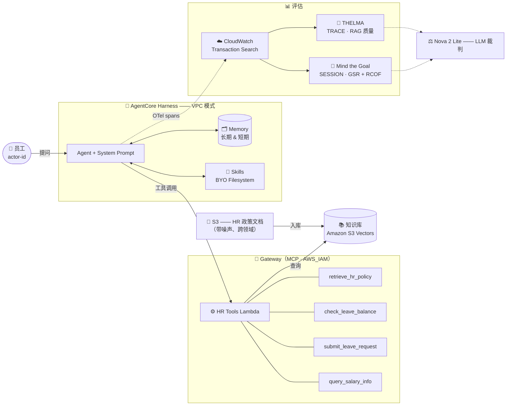
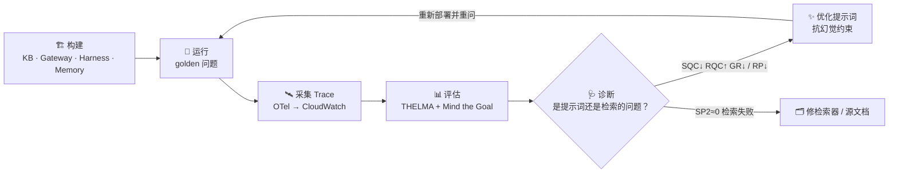

<div align="center">

# 🧪 Eval-First：用 Amazon Bedrock AgentCore 构建企业级 Agent

**搭一个贴近真实的企业 HR 问答 Agent，然后用代码化的评估器去 _量化_ 它的质量，而不是靠人眼看几条回答下结论。**

<br/>


[English](README.md) | **简体中文**

</div>

---

> [!NOTE]
> 这是配套 **《Eval-First：用 AgentCore 构建企业级 Agent》** workshop 的动手代码包。它是**自包含**的——内含 CloudFormation 模板（`cfn/workshop-infra.yaml`）、知识库工具（`knowledge-base/`）、HR Tools Lambda（`lambda/`）、Gateway 工具（`gateway/`）以及两个自定义评估器（`evaluators/`）。按顺序跑完这些脚本，就能在**你自己的账号**里从零搭出整套系统。

> [!IMPORTANT]
> **请从上到下照着本文走。** 每一步都写清了它做什么、依赖什么、产出什么。脚本要**按编号顺序**跑——每个脚本结束时会打印 `Next: ...` 指向下一步。

---

## 📑 目录

1. [这套东西在搭什么，为什么这么搭](#1-这套东西在搭什么为什么这么搭)
2. [架构速览](#-架构速览)
3. [Eval-First 循环](#-eval-first-循环adlc)
4. [前置条件](#2-前置条件)
5. [执行顺序速览](#3-执行顺序速览)
6. [逐步说明](#4-逐步说明)
7. [可选实验](#-可选实验)
8. [清理](#5-清理--99-cleanupsh)
9. [数据来源与署名](#6-数据来源与署名)

---

## 1. 这套东西在搭什么，为什么这么搭

这个 sample 的核心是 **eval-first**：重点在于先立起一个贴近真实的企业 Agent，再**用代码化的评估器去量化它的质量**，而不是凭眼睛扫几条回答。脚本会搭出一个 HR 问答 Agent（基于 Amazon Bedrock AgentCore 的知识库 + Gateway 工具 + Memory），跑起来产出 trace，再用两个自定义评估器给这些 trace 打分。

这两个评估器是整个 sample 的核心。它们放在 `evaluators/` 下，是对**已发表研究方法**的独立复现（不是 AWS 产品），并被接到 Amazon Bedrock AgentCore 上运行：

### 🔬 `thelma_eval/` —— 单轮 RAG 质量（THELMA）

在 **`TRACE`** 级别运行。把一次问答拆成 `(问题, 检索到的来源, 回答)`，打 **6 项指标**（0–1）：

| 指标 | 全称 | 它回答什么问题 |
|:------:|------|---------------------|
| **SP**  | Source Precision（来源精确率）        | 检索到的文档相关吗？ |
| **SQC** | Source Query Coverage（来源覆盖率）   | 来源能覆盖这个问题吗？ |
| **RP**  | Response Precision（回答精确率）      | 回答是否切题？ |
| **RQC** | Response Query Coverage（回答覆盖率） | 问题是否被完整回答？ |
| **SD**  | Self-Distinctness（自洽不重复）       | 回答内部有没有重复啰嗦？ |
| 🎯 **GR** | **Groundedness（有据性）** | **每句话都有来源支撑吗？（即有没有幻觉，通过线 ≥ 0.7）** |

它真正的价值在于**诊断**——这些分数之间的*相互关系*能指出该修 RAG 的哪个环节（检索器 vs. 提示词 vs. 源文档）。

### 🎯 `mtg_eval/` —— 多轮目标达成（Mind the Goal）

在 **`SESSION`** 级别运行，分三步：**切分目标**（把围绕同一件事的多轮合并成一个目标）、**判定成功/失败**（一个目标里任意一轮失败则整个目标算失败），然后算出 **GSR** = *Goal Success Rate（目标达成率）*（成功目标数 ÷ 总目标数，通过线 ≥ 80%），并用 **RCOF** = *Root Cause of Failure（失败根因）*（7 类缺陷归因）给每个失败定位。它回答的是*「Agent 到底有没有完成用户来办的事」*。

两个评估器都用 `us.amazon.nova-2-lite-v1:0` 作为裁判模型。每个评估器都打包了自己的算法、一层**适配层**（ADOT span → 评估器输入）和一个 Lambda handler。

> [!TIP]
> 完整的指标定义、THELMA 诊断表、论文引用和许可信息，见 **[`evaluators/README.md`](evaluators/README.md)**。

为了让评估有意义，知识库被**故意灌入了带噪声的跨领域数据**（见 [§6](#6-数据来源与署名)）——这样 THELMA 的分数才能暴露真实的检索质量问题，而不是给出一个干净的玩具级结果。

---

## 🏗️ 架构速览

Agent 以 VPC 模式跑在一个 AgentCore **Harness** 里。每次调用都会把 Memory + Skills 拉进上下文，通过 **Gateway**（MCP）调用 HR 工具，并吐出 OTel trace span 流向 CloudWatch——两个评估器就在那里读取它们。



---

## 🔁 Eval-First 循环（ADLC）

本 workshop 闭合了 **Agent 开发生命周期（ADLC）**：构建、运行、采集 trace、评估、_诊断_，再优化——并用一次重新评估来证明修复确实有效。



> [!TIP]
> 最有说服力的是这个对比：改提示词能在「检索本来就好」的地方提升有据性，但**修不了**一个检索本身就失败（`SP2≈0`）的问题。这个对比恰恰就是 THELMA 区分*「该修提示词」*还是*「该修检索」*的方式。

---

## 2. 前置条件

这些脚本会**在你自己的 AWS 账号里从零搭出整套系统**。请在 **`us-west-2` 的一台 EC2 实例**上运行。所有步骤必须**按顺序**跑，从基础设施栈（`00-deploy-infra.sh`）开始。

### 🧰 工具

| 要求 | 说明 |
|-------------|-------|
| AWS 账号 | 你自己的账号，并在 **`us-west-2`** 有一台 EC2 实例用于运行 |
| AWS CLI | 已配置好凭证（`aws sts get-caller-identity` 要能成功） |
| Node.js | v20+ |
| Python | 3.10+（带 `pip`） |
| AgentCore CLI | `npm i -g @aws/agentcore@preview` |

### 🔐 IAM 权限

你运行所用的身份（如 EC2 实例角色，或你的 CLI 用户）需要有创建和管理以下服务的权限。

> [!WARNING]
> **只读或权限过窄的角色会失败。** 脚本会涉及：
> `cloudformation`、`ec2`（VPC/子网/NAT/SG）、`s3` + `s3vectors`、`iam`（创建/挂载角色和策略）、`bedrock` + `bedrock-agent` + `bedrock-agentcore-control`、`lambda`、`ssm`、`logs`、`xray`、`application-signals`、`sts`。

如果账号是你自己控制的，给 EC2 实例角色挂一个宽松策略（或 `PowerUserAccess` + `IAMFullAccess`）是保证整套流程跑通最省事的办法。跑完后按需收紧即可。

### 🌎 区域

在你运行一切的那个 shell 里**一次性**设好区域（所有脚本默认 `us-west-2`；基础设施脚本也支持 `us-east-1` 和 `us-east-2`）：

```bash
export AWS_DEFAULT_REGION=us-west-2
cd static/scripts
chmod +x *.sh
```

---

## 3. 执行顺序速览

下面的耗时是在一个空白账号（us-west-2）上端到端跑出来的近似值。整体约 **25–30 分钟**，大部分是无人值守的等待。

| # | 脚本 | 阶段 | ⏱️ 约耗时 | 创建/做什么 |
|:-:|--------|:-----:|:--------:|------------------------|
| 1 | `00-setup.sh` | 0 | ~5s | 校验 CLI，创建 `~/workshop` 目录 |
| 2 | `00-deploy-infra.sh` | 0 | ~5 分钟 | **必须。** CFN 栈 `workshop-infra`：VPC + 子网 + NAT + SG，S3 数据桶 + Access Point，EC2 |
| 3 | `01-create-kb.sh` | 0 | ~2 分钟 | Bedrock 知识库（**S3 Vectors**）+ HR 政策文档 + 入库；把 KB ID 写入 SSM |
| 4 | `02-create-gateway.sh` | 2 | ~30s | 部署 HR Tools **Lambda** + IAM 角色，再用该 Lambda 作为 target 创建 **Gateway** |
| 5 | `03-configure-skills.sh` | 2 | ~5s | 写好 SKILL.md 文件并上传到 S3 |
| 6 | `04-deploy.sh` | 2 | ~6 分钟 | 创建 **Harness**，挂上 Gateway 工具 + Skills，部署（一次成型） |
| 7 | `05-setup-memory.sh` | 2 | ~1–2 分钟 | 在 Harness 上配置 Memory **检索**（会等 Runtime READY） |
| 8 | `06-test-conversation.sh` | 3 | ~20s | 跑第一次对话（生成一条 trace） |
| 9 | `07-setup-eval-env.sh` | 4 | ~30s | 安装 `uv` + 开启 CloudWatch **Transaction Search** |
| 10 | `06-test-conversation.sh` *（再跑一次）* | 4 | ~20s | 在 Transaction Search 开启**之后**重新生成一条 trace |
| 11 | `08-create-evaluators.sh` | 4 | ~2 分钟 | 注册 + 部署 THELMA 和 Mind the Goal 评估器 |
| 12 | `09-run-eval.sh` | 4 | ~2–3 分钟 | 跑 3 个 golden 问题，再评估它们（Query + Response + 分数） |
| 13 | `10-optimize-prompt.sh` | 5 | ~6–8 分钟 | 优化 System Prompt（抗幻觉），重新部署，重跑 + 重新评估 |
| — | `11-cost-latency.sh` | 6 | ~30s | _可选。_ 从 `aws/spans` 读出每条 trace 的延迟 + token + 成本（不新建资源） |
| — | `12-compare-models.sh` | — | ~10–15 分钟 | _可选实验 A。_ 换模型、重新部署、重跑 + 重新评估，对比质量/成本/延迟，再还原 |
| — | `13-judge-stability.sh` | — | ~1–2 分钟 | _可选实验 B。_ 对同一条 trace 连打 N 次，检验裁判可重复性 |
| — | `99-cleanup.sh` | — | ~10–15 分钟 | 全部拆掉（按依赖逆序；幂等） |

---

## 4. 逐步说明

### 🟢 第 1 步 —— `00-setup.sh`  ·  _Phase 0_
校验 `agentcore`、`node`、`aws` 是否已安装，打印你的账号/区域，并创建 `~/workshop/skills/...` 目录。

```bash
./00-setup.sh
```

### 🟢 第 2 步 —— `00-deploy-infra.sh`  ·  _Phase 0 —— 必须_
部署 `workshop-infra` CloudFormation 栈：VPC、私有子网、NAT、安全组、**数据** S3 桶 + Access Point，以及一个 EC2 工作环境（通过 SSM 连入）。模板会自动挑选 AgentCore 支持的 AZ。约 5–8 分钟。

```bash
./00-deploy-infra.sh
```

> [!CAUTION]
> **不要跳过这一步。** 后续步骤依赖这个栈的输出：
> - `01-create-kb.sh` 要读 **`DataBucketName`** 输出才知道把知识库数据源放哪——栈不存在它就会**失败**。
> - `04-deploy.sh` 用 VPC/子网/SG 输出来把 Harness 部署成 VPC 网络模式。
>
> 脚本是幂等的：如果 `workshop-infra` 栈已存在，它会跳过创建、只打印输出。

### 🟢 第 3 步 —— `01-create-kb.sh`  ·  _Phase 0_
生成 11 份 HR 政策 markdown 文档，然后创建一个由 **Amazon S3 Vectors** 支撑的 Amazon Bedrock 知识库（嵌入模型 `amazon.titan-embed-text-v2:0`，1024 维），把文档入库，并把 KB ID 存到 SSM 的 `/app/hr/knowledge_base_id`。下一步的 Lambda 直接从这里读——**不需要手动设环境变量**。

> [!NOTE]
> HR 政策正文是由 `knowledge-base/generate_hr_docs.py` 生成的**合成示例数据**。每篇文档还会追加一段**源自 HR-MultiWOZ 数据集的 FAQ**（arXiv:2402.01018，**Apache-2.0**；打包在 `knowledge-base/domain_faqs.py` 里）。这些 FAQ 是故意带噪声、跨领域的——用来模拟真实企业知识库里那种「脏」数据，好让评估能暴露检索质量问题。见 [§6 数据来源与署名](#6-数据来源与署名)。文中引用的模型（`amazon.titan-embed-text-v2:0`、`us.amazon.nova-2-lite-v1:0`）是作为托管的 Amazon Bedrock 模型调用的——不包含也不分发任何模型权重。

```bash
./01-create-kb.sh
```

完成时会打印完整的 KB 详情（ID、数据位置、向量库、嵌入模型）。数据桶名是从 `workshop-infra` 栈的输出 `DataBucketName` 自动读取的——**所以第 2 步必须先完成**，否则脚本会以 `Stack 'workshop-infra' has no DataBucketName output — is workshop-infra deployed?` 中止。

> [!TIP]
> **成本提示：** Amazon S3 Vectors 按存储 + 查询计费（没有常开集群），所以比常开的向量数据库便宜得多——但**用完仍然要删**（见清理章节）。

### 🔵 第 4 步 —— `02-create-gateway.sh`  ·  _Phase 2_
一步做两件事：
1. 打包并部署 **HR Tools Lambda**（`hr-tools-handler`）及其 IAM 角色（带从 SSM 读 KB ID、查询知识库的权限）。
2. 通过 `gateway/create_gateway.py` 创建 **Gateway**（MCP 协议，AWS_IAM 鉴权），并把上面那个 Lambda 设为它的 target。Gateway ARN 会写入 SSM 的 `/app/hr/gateway_arn`。

```bash
./02-create-gateway.sh
```

Gateway 暴露四个工具：`retrieve_hr_policy`、`check_leave_balance`、`submit_leave_request`、`query_salary_info`。

### 🔵 第 5 步 —— `03-configure-skills.sh`  ·  _Phase 2_
写好两个 SKILL.md 文件（`deep-policy-analysis`、`leave-calculator`）并上传到 S3 数据桶的 `skills/` 下。它们会在下一步被挂载进 Harness（BYO Filesystem）。

```bash
./03-configure-skills.sh
```

### 🔵 第 6 步 —— `04-deploy.sh`  ·  _Phase 2_
创建 Harness 项目，按 ARN 挂上**已存在的** Gateway（这样不会重复创建 Gateway——这正是部署能**一次成型**的原因），写入 system prompt，把 `allowedTools` 限制为 `@hr-tools/*`，挂载 Skills 文件系统，然后部署。

```bash
./04-deploy.sh
```

> [!NOTE]
> **网络模式：** 有了 `workshop-infra` 栈（第 2 步），Harness 会用该栈的子网/SG 部署成 **VPC** 模式。（如果栈缺失，脚本会回退到 PUBLIC 模式并跳过 Skills 挂载——但本流程里第 2 步是必须的，所以你拿到的是 VPC 模式。）

### 🔵 第 7 步 —— `05-setup-memory.sh`  ·  _Phase 2_
在已部署的 Harness 上配置 Memory **检索**，这样每次调用都会自动从 Memory 拉取用户的偏好和事实并注入上下文。

```bash
./05-setup-memory.sh
```

> [!NOTE]
> `04-deploy.sh` 已经*创建*了 Memory 资源（`--memory longAndShortTerm`）。这一步是把每次调用的自动*检索*接上——两者不是一回事。

### 🟣 第 8 步 —— `06-test-conversation.sh`  ·  _Phase 3_
用一个全新的 session ID 和 `actor-id employee-001` 跑第一次对话（问年假政策）。此刻回答会刻意地很通用——Agent 还不知道你的工龄或部门。这一步也会产出第一条 **trace**。

```bash
./06-test-conversation.sh
```

---

### 🟠 第 9 步 —— `07-setup-eval-env.sh`  ·  _Phase 4 准备_
安装 `uv`（打包评估器 Python 依赖需要它）并开启 **CloudWatch Transaction Search**，这样 Agent 的 OTel trace span 才会落到 CloudWatch、被评估服务读到。

```bash
./07-setup-eval-env.sh
```

> [!TIP]
> 如果脚本提示你，把 `uv` 加进 PATH：
> ```bash
> export PATH="$HOME/.local/bin:$PATH"
> ```

### 🟠 第 10 步 —— `06-test-conversation.sh` *（再跑一次）*  ·  _Phase 4_
Transaction Search 只会捕获它**开启之后**产生的 span。重跑一次对话，生成一条评估器能读到的 trace：

```bash
./06-test-conversation.sh
```

### 🟠 第 11 步 —— `08-create-evaluators.sh`  ·  _Phase 4_
注册并部署两个自定义的代码化评估器，再给它们的执行角色授予 Bedrock invoke 权限（LLM 裁判需要）：

- `thelma_rag_quality` —— **TRACE** 级，RAG 6 维质量，主分 = **Groundedness（有据性）**
- `mtg_goal_success` —— **SESSION** 级，**目标达成率（GSR）** + 失败归因（**RCOF**）

每个指标的含义见 [`evaluators/README.md`](evaluators/README.md)。

```bash
./08-create-evaluators.sh
```

### 🟠 第 12 步 —— `09-run-eval.sh`  ·  _Phase 4_
默认会跑 **3 个 golden 问题**（绩效评估 / 福利 / 病假）产出 trace，等它们索引完成，再评估这些 trace，并为每条打印：**Query**、截断后的 **Response**、以及**分数**（THELMA 6 维拆解 + 诊断，外加 Mind the Goal 的 GSR + RCOF）。

```bash
./09-run-eval.sh                        # 跑 3 个 golden 问题，再评估它们（两个评估器）
./09-run-eval.sh --eval-only [N]        # 跳过对话；评估最近 N 条含检索的 trace（默认 3）
./09-run-eval.sh <trace-id>             # 只跑 THELMA，针对一条 trace
./09-run-eval.sh <session-id> session   # 只跑 Mind the Goal，针对一个 session
```

### 🔴 第 13 步 —— `10-optimize-prompt.sh`  ·  _Phase 5_
闭合 ADLC 循环。依据 Phase 4 的诊断（`SQC↓ RQC↑ GR↓` / `RP↓` → 提示词问题），它会：
1. 写一份带**抗幻觉约束**的优化版 System Prompt（「严格基于检索内容回答 / 忽略不相关 chunk / 简洁」），
2. `agentcore deploy` 重新部署，
3. 用**同样的 3 个 golden 问题**重问一遍（v2 session），
4. 重新评估新的 trace（复用 `09-run-eval.sh --eval-only`）。

```bash
./10-optimize-prompt.sh
```

和优化前的分数对比：检索本来就好的问题（绩效评估、福利），有据性/精确率会提升；而病假问题（SP2≈0，检索失败）仍然 Fail——改提示词修不了它。这个对比**印证了 THELMA 的诊断**：它能区分「该修提示词」还是「该修检索」。

> [!NOTE]
> 优化后的提示词是**中文**（与中文 KB 文档对齐）。提示词语言和 KB 对齐后，抗幻觉约束才能最有效地落地。注意 LLM-as-judge 的分数在不同次运行间会波动——看趋势和诊断方向，别盯单一绝对值。

---

## 🧪 可选实验

下面三个是核心约 2 小时主线之外的**可选延伸**。它们复用你已部署好的 Agent 和评估器，所以**要在 `99-cleanup.sh` 之前跑**——一旦清理，这些资源就没了。

### ⚙️ `11-cost-latency.sh` —— 运营指标（成本与延迟）  ·  _Phase 6_
decision-first agent 开篇承诺了三个维度：**答得好 / 答得快 / 省人力**。THELMA 已经量化了「答得好」，这个脚本补上另外两个——而且**不新建任何资源**。它从 CloudWatch `aws/spans`（与 `09-run-eval.sh` 同一个 log group）读出你**已经产出的那批 trace**，逐条算出**端到端延迟**（最大 span 结束时间 − 最小 span 开始时间）、**输入/输出 token**（取自 `gen_ai.usage.*` span 属性）和**成本**（token 数 × Nova 2 Lite 单价）。最终就是给 CXO 的那张记分牌：质量（GR）+ 速度（延迟）+ 成本（$）并排放。

```bash
./11-cost-latency.sh            # 算最近 N 条含检索 trace 的延迟 + token + 成本
./11-cost-latency.sh <trace-id> # 只算一条 trace
```

> [!TIP]
> 不同 SDK 版本 token 字段名不一样（`gen_ai.usage.input_tokens` vs `inputTokens` …）——脚本会尝试多个候选键。单价（`PRICE_IN` / `PRICE_OUT`，$/1M token）默认是 Nova 2 Lite；可用环境变量覆盖，并请以 AWS 官网定价为准。

### 🔬 可选实验 A —— `12-compare-models.sh`（多模型对比）
回答每个 CXO 都会问的一句：*「能不能换个更便宜/更快的模型，质量还过得去？」* 它会**非破坏性地**把 Harness 模型换掉、重新部署、用同样的 3 个 golden 问题重跑、用同一个 THELMA 打分、和 Phase 4 基线对比质量/成本/延迟，然后**还原回基线模型**。把「换模型」从拍脑袋变成看数据。

```bash
./12-compare-models.sh                          # 默认对比模型 = Nova Pro
./12-compare-models.sh us.amazon.nova-pro-v1:0  # 等价默认值
./12-compare-models.sh us.anthropic.claude-haiku-4-5-20251001-v1:0  # 想试别家也可
```

> [!WARNING]
> 它是在 **`harness.json` 里替换模型并重新部署**——**不会**重跑 `04-deploy.sh`（那会 `rm -rf hrassistant`、把评估器一起删掉）。对比模型别用 **Nova Micro** 这一档：在 Strands 严格 ToolUse 协议下它经常报 `Model produced invalid sequence as part of ToolUse`，三次对话全失败、拿不到数据。这种不稳本身是个有用的评估结论——*该模型与你当前的 Agent 拓扑不兼容*——但不适合放在 demo 首发。

### ⚖️ 可选实验 B —— `13-judge-stability.sh`（裁判稳定性）
回答 CXO 必问的后续：*「你这个 AI 裁判（THELMA）自己靠谱吗？会不会瞎打分？」* 这是一个轻量的**可重复性**检验：对**同一条 trace** 连打 N 次、看分数分布——分数稳定说明裁判可信；分数忽上忽下说明结论要谨慎对待（小模型尤其容易这样）。

```bash
./13-judge-stability.sh                # 取最近一条含检索 trace，打 3 次
./13-judge-stability.sh <trace-id> [N] # 指定 trace，打 N 次（默认 3）
```

> [!NOTE]
> 本 workshop 的裁判默认用 **Nova 2 Lite**（小模型）。小模型做 LLM-as-judge 一致性通常不如大模型，分数抖动可能偏大——这正是这个实验要暴露的。可重复性只是一项轻量检验；生产推荐的并行做法是**人工样本校准**（拿标注集算 TPR/TNR）。

---

## 5. 清理 —— `99-cleanup.sh`

> [!CAUTION]
> **workshop 结束后务必跑这个**，以免持续计费（知识库、Lambda、NAT 网关等）。

```bash
./99-cleanup.sh
```

脚本会把一切拆掉。如果栈删除被托管 ENI 卡住，它会回退到「保留资源」式删除，让栈仍能删完；剩下的 VPC 网络资源 AWS 会自己回收（不计费、无需操作）。脚本是幂等的——重跑是安全的。

---

## 6. 数据来源与署名

知识库文档结合了两个来源：

- **HR 政策正文** —— 为本 workshop 编写的合成示例内容（`knowledge-base/generate_hr_docs.py`）。
- **FAQ 段落** —— 源自 **HR-MultiWOZ** 数据集，打包在 `knowledge-base/domain_faqs.py` 里。它们是故意带噪声/跨领域的，用来演示 eval-first 的优化循环。

> **HR-MultiWOZ: A Task Oriented Dialogue (TOD) Dataset for HR LLM Agent**
> Weijie Xu, Zicheng Huang, Wenxiang Hu, Xi Fang, Rajesh Kumar Cherukuri, Naumaan Nayyar, Lorenzo
> Malandri, Srinivasan H. Sengamedu. arXiv:2402.01018. 许可：**Apache-2.0**。
> 数据集：https://huggingface.co/datasets/xwjzds/extractive_qa_question_answering_hr

两个自定义评估器（THELMA、Mind the Goal）是对已发表研究方法的独立复现——引用和许可见 [`evaluators/README.md`](evaluators/README.md)。

---

## 🔒 安全

更多信息见 [CONTRIBUTING](CONTRIBUTING.md#security-issue-notifications)。

## 📄 许可

本库基于 MIT-0 许可。见 [LICENSE](LICENSE) 文件。
