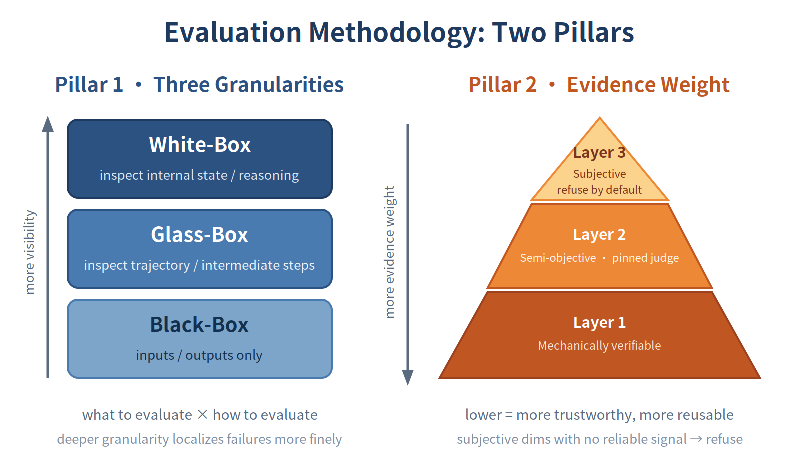
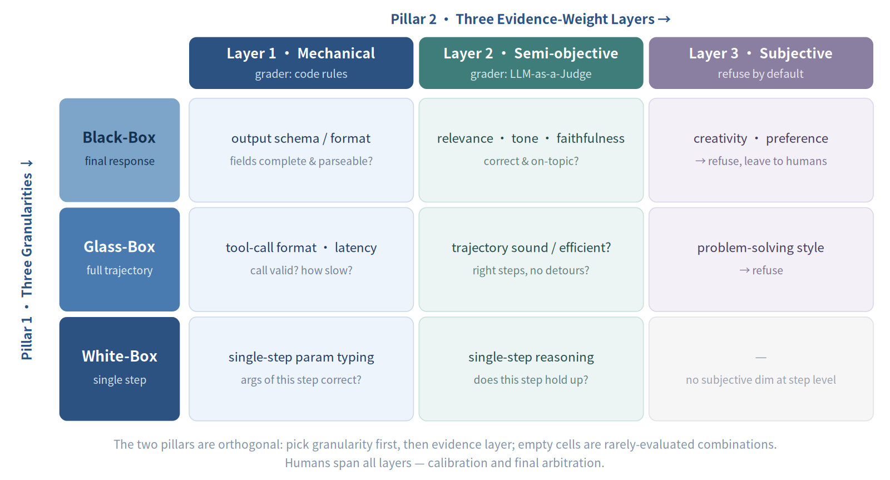
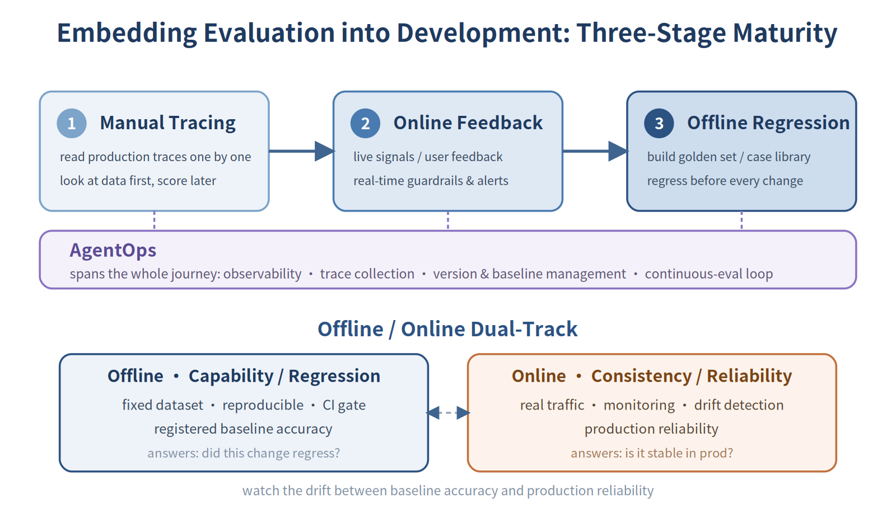
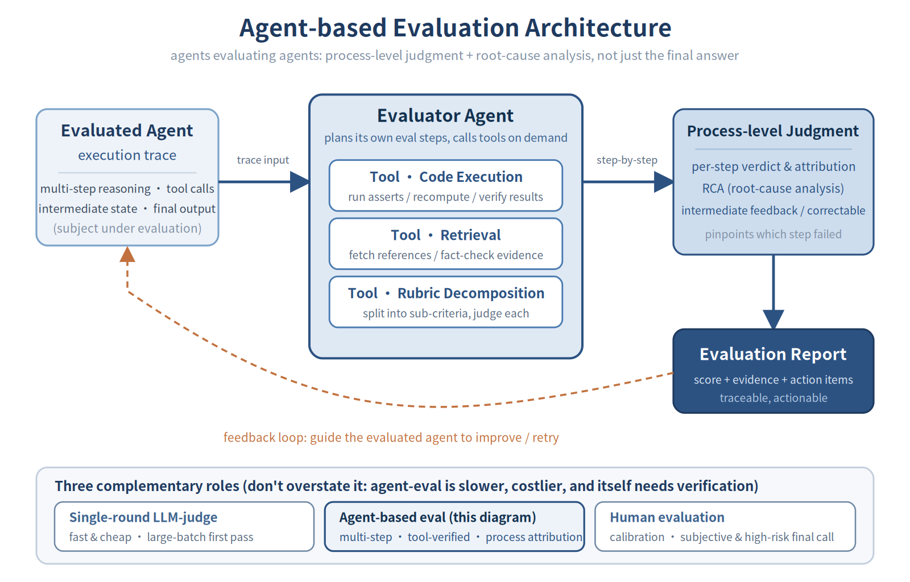

# Enterprise Production-Grade AI Agent Development and Deployment Guide Series

## 📑 Table of Contents
- **Part 1 · The Enterprise Agent Journey: Why Evaluation is the Starting Point of Everything**
  - From Prototype to Production: An Underestimated Gap
  - Why Traditional Software Engineering Methods Fail for Agents
  - ADLC (Agent Development Lifecycle): A Development Lifecycle Tailored for Agents
  - Enterprise Agentic Development: Three Categories of Engineering Practices
    - Category 1: Getting Evaluation Running
    - Category 2: Ensuring Data Continuously Flows into Evaluation
    - Category 3: Making System Architecture Evaluable
  - Conclusion: Evaluation is Specification, Quality Gate, Production Monitoring, and Driver of Improvement
- **Part 2 · Evaluating Enterprise-Grade Agents: From Prototype Validation to Production Readiness**
  - Three Common Misconceptions in Agent Evaluation
  - Evaluation Methodology Framework: Two Pillars (Evaluation Granularity + Evidence Weight)
  - Grader Selection and Eight Measurement Dimensions
  - Engineering Implementation of Evaluation: From Process Integration to Dataset Accumulation
  - The Value and Boundaries of LLM-as-a-Judge
  - Agent-based Evaluation: Scaling Expert-Level Review
  - Best Practices Checklist and Conclusion
- **Part 3 · How to Build Enterprise-Grade Agents on Amazon Web Services**
  - 3.1 Evaluation Framework Overview: Automated Workflow + Three-Layer Evaluation Library
  - 3.2 Key Metrics System: Select Metrics by Agent Type, Don't Just Pile Them On
  - 3.3 Trace-driven Evaluation Workflow: Four Steps to Automate Evaluation
  - 3.4 Evaluation Datasets and HITL: They Determine the Upper Limit of Evaluation Quality
  - 3.5 Engineering Discipline: Embed Evaluation into Development Process, Not Just Run It Once Before Launch
  - 3.6 Tool Support: AgentCore Evaluations
- **Part 4 · Real-world Cases: From Tool Usage to Multi-Agent Collaboration**
  - 4.1 Case One: Amazon Shopping Assistant — Tool Usage Evaluation
  - 4.2 Case Two: Amazon Customer Service Agent — Intent Detection Evaluation
  - 4.3 Case Three: Amazon Seller Assistant — Multi-Agent Collaboration Evaluation
- **Conclusion: Making Evaluation the Default Mechanism of Agent Engineering**
---
## 📌 Series Summary
This four-part series aims to provide enterprise teams with a roadmap of engineering disciplines from prototype to production. The entire content revolves around a core proposition: **The bottleneck in engineering AI agents into production is not model capability, but the lack of a sustainable engineering system to measure "how good it is."**
- **Part 1 · Why Evaluation is the Starting Point**: Starting from "why traditional software engineering methods fail for agents," we analyze three root causes: non-determinism, Prompt as source code, and dependencies that drift on their own. We then propose ADLC (Agent Development Lifecycle)—a development lifecycle tailored for agents—and categorize enterprise Agentic development into three engineering practices: getting evaluation running / ensuring data continuously flows into evaluation / making system architecture evaluable.
- **Part 2 · Evaluation Methodology**: Clarifies three common evaluation misconceptions, establishes a two-pillar evaluation framework—three evaluation granularities (black-box / glass-box / white-box) and three layers of evidence weight; identifies eight dimensions enterprises need to measure (quality, performance, responsibility, cost...); discusses the value and boundaries of LLM-as-a-Judge, and introduces Agent-based Evaluation to scale expert-level review.
- **Part 3 · Building Enterprise-Grade Agents on AWS**: Provides a complete engineering implementation picture—automated evaluation workflow + three-layer evaluation library; matches key metrics by agent type (single Agent / tool invocation / multi-Agent); explains the four steps of Trace-driven evaluation workflow; and embeds evaluation into the development process, forming an Observability → Evaluation → Optimization closed loop with AgentCore Evaluations.
- **Part 4 · Real-world Cases**: Uses three production-grade Amazon internal cases corresponding to different evaluation focuses—shopping assistant (tool usage), customer service agent (intent detection), seller assistant (multi-agent collaboration), covering the evolution path of agents from simple to complex, ultimately converging on an evaluation closed loop you can run yourself.
For more information on how the Evaluation-first approach is implemented in real scenarios, refer to the accompanying hands-on lab sample code: https://github.com/aws-samples/sample-eval-first-building-enterprise-agents-with-agentcore
# Part 1: The Enterprise Agent Journey: Why Evaluation is the Starting Point of Everything
## From Prototype to Production: An Underestimated Gap
Over the past year, AI agents have moved from technical exploration into the engineering implementation phase. More and more enterprise teams are building LLM systems capable of invoking tools, orchestrating workflows across multiple APIs, and creating conversational assistants based on internal knowledge bases.
The prototype validation phase typically goes smoothly—demos perform impressively, and business stakeholders provide positive feedback. However, when teams attempt to push these systems into production, a critical question emerges: **Is it really ready for production?**
Most teams encounter bottlenecks precisely here. The limiting factor is not model capability itself, but the lack of an **engineered quality assessment system**—a methodology that can continuously answer "how good is it really?"
This gap is not coincidental. Traditional software has unit tests, CI/CD pipelines, and clear pass/fail criteria. AI agents do not. The same user input produces one result today, but tomorrow, after switching model versions, the behavior quietly changes without any alerts. Developers cannot even use a single assert statement to verify whether a multi-step reasoning process is correct.
**This is fundamentally an engineering discipline problem, not a model capability problem.**
This series of four articles aims to provide a complete roadmap of agent engineering disciplines. We start with the first thing that must be solved—**Evaluation**. It is the foundation of all other engineering practices: without evaluation, teams don't know where they are, nor whether changes have made things better.
## Why Traditional Software Engineering Methods Fail for Agents
Software engineers naturally treat AI agents as "another type of software": write logic, test, deploy to CI/CD. This intuition is reasonable, but it systematically fails when applied to agents. There are three reasons.
### 1. Non-determinism: Test Cases Pass Today, May Fail Tomorrow
Traditional software testing logic is simple: given input A, assert output is B. This doesn't hold for agents.
LLMs are fundamentally probabilistic models. For the same input, each invocation produces outputs that differ in statistical distribution. More counterintuitively, even setting temperature to 0 (commonly understood as "most deterministic mode"), outputs still cannot be guaranteed to be completely consistent: non-associativity of GPU floating-point operations, Mixture-of-Experts routing mechanisms, and batch processing order dependencies all introduce small but real variations. Currently, no mainstream model provider promises completely deterministic outputs.
Thus, traditional pass/fail testing frameworks simply don't apply here. What we need is not assertions, but **evaluation**—measuring behavior over a distribution, rather than verifying a deterministic result.
### 2. Natural Language IS "Source Code": Changing Prompts IS Changing Code
In traditional software, code changes leave Git diffs, undergo code reviews, have version history, and rollback paths. Prompts have none of this.
Modifying a system prompt—perhaps just adding one sentence at the end—can fundamentally change agent behavior: it may start refusing certain types of requests, change the order of tool invocations, or quietly alter output formats. No static analysis tool can predict the impact scope of such modifications in advance.
Therefore, **every prompt change must be accompanied by evaluation to quantify impact**. Without evaluation, prompt engineering is shooting in the dark.
### 3. Dependencies Move on Their Own: Nothing Deployed, But Agent Behavior Changed
Traditional software dependencies are locked: package.json has version numbers, and what happens during upgrades is predictable. Models are implicit dependencies, and they update themselves.
Model providers periodically apply safety fine-tuning, capability upgrades, or system prompt adjustments to models, typically without releasing detailed changelogs. The result: no code changes whatsoever, but one morning the agent starts producing different responses to certain questions—more conservative, format changed, or tool invocation tendencies shifted. Without continuous evaluation baselines, such drift is almost impossible to detect in time.
These three points converge on the same conclusion: **traditional CI/CD and QA frameworks were not designed for such systems**. We need a new methodology—an engineering system capable of continuously measuring system quality under conditions of probabilism, variability, and implicit dependencies. This is what we'll discuss next: ADLC.
## ADLC (Agent Development Lifecycle): A Development Lifecycle Tailored for Agents
Since traditional SDLC fails for agents, we need a methodology tailored for them. The framework forming consensus in the industry is called **ADLC (Agent Development Lifecycle)**—not a patch on SDLC, but a complete reconstruction.
### ADLC is a Flywheel, Not a Pipeline
Traditional software development is linear: requirements → design → development → testing → deployment. Deployment is the endpoint; the next version starts from scratch. This logic doesn't hold for agents, because **every conversation an agent runs in production is the most valuable data about its real behavior**.
ADLC is a continuously spinning flywheel with six interconnected stages:
1. **Define "Good"**: Before building, determine what success looks like. This is not a vision statement, but concrete evaluation criteria and baseline datasets.
2. **Build**: Construct the agent system based on clear definitions.
3. **Evaluate**: Systematically measure agent behavior using standards defined in step one.
4. **Gate Deployment**: Evaluation isn't just for observation—it's the pass to production. If evaluation metrics don't meet thresholds, don't deploy.
5. **Production Observability**: After agents go live, continuously track their performance under real traffic—latency, success rate, tool invocation patterns, user feedback.
6. **Mine Failure Cases**: Find samples where agents fail or behave abnormally from production traces, add them to evaluation sets, and iterate continuously.
### The Key Difference from Traditional CI/CD
In traditional pipelines, "production" is the endpoint of the process. **In ADLC, production is the flywheel's most valuable input.**
This shift is profound. It means evaluation sets are not static assets defined once at project inception, but **dynamic systems that grow continuously with production data**. Every real failure case exposed in production is more valuable than test cases preset in conference rooms—because it comes from real users, triggered real problems in real contexts.
There's another long-term value chain worth noting: **production traces can become evaluation data; evaluation data, when accumulated to sufficient scale, can become training data for fine-tuning or distillation**. The cost invested in observability and evaluation systems today will generate compound returns in the form of model optimization in the future.
### Define "Good" First, Not Post-Launch Retrospective
This ordering seems obvious, but is often reversed in practice. Many teams follow this sequence: build the demo first, wait for user feedback after launch, then figure out how to measure quality.
This often means significant rework costs. Without evaluation baselines at launch, you cannot determine whether the next change made things better or worse. What's lost is not just the ability to validate one prompt improvement, but **the entire system's sense of direction for iteration**.
ADLC mandates putting "define 'good'" first, essentially requiring teams to clarify acceptance criteria before starting construction—like producing blueprints before building, not drawing them after the building is complete.
## Enterprise Agentic Development: Three Categories of Engineering Practices
After understanding ADLC methodology, implementation requires concrete engineering practices. In AWS's experience accumulated from numerous enterprise agent projects, practices appear scattered but share one common thread: **they're either directly doing evaluation, or laying the foundation for evaluation**.
Looking closely, these practices answer three questions: how to get evaluation itself running, how to ensure data continuously flows into the evaluation system, and how to make system architecture evaluable. All three are indispensable—the evaluation process is the outlet, data is the pipeline, architecture is the foundation. Let's expand on this logic in three categories.
## Category 1: Getting Evaluation Running
### Start Small, First Define What "Success" Looks Like
Many teams launching agent projects ask first: "What can this agent do?" This is the wrong starting point.
**The correct first question is: What problem are we solving?**
Start from the problem, work backward to agent boundaries: what should it handle, what should it not handle. If building a financial analysis assistant, first focus on just three things: "query quarterly revenue, calculate growth rates, generate summaries." Make these reliable, then expand. Don't try to cover all scenarios from the start—that only makes prompts increasingly complex, tool selection increasingly chaotic, and performance increasingly difficult to attribute.
**Launching an agent project should produce four concrete deliverables, not just code:**

1. **Clear definition of what the agent should and should not do**. Write it down, share with stakeholders, use it to refuse feature creep.

2. **Agent tone and personality**. Decide whether it's formal or conversational, how it greets users, and how it handles out-of-scope questions.

3. **Explicit definition of every tool, parameter, and knowledge source**. Vague descriptions lead agents to make wrong choices.

4. **Baseline dataset of expected interactions**, covering common queries and edge cases.

The last item is key. **The baseline dataset is the "fuel" of the entire evaluation system**—without it, the evaluation system cannot run; even "has the agent improved" becomes unanswerable. It's not something to supplement after launch, but infrastructure to prepare before starting.

Below are the four deliverables for three typical agent types for reference:
| Agent Type | Agent Definition | Tone & Personality | Tool Definition | Baseline Dataset |
|------------|------------------|-------------------|-----------------|------------------|
| **Financial Analysis Agent** | Help analysts query quarterly revenue data by region (EMEA, APAC, AMER), calculate growth metrics, generate executive summaries. Does not provide investment advice, execute trades, or access employee compensation data. | Professional yet approachable, addresses users by name; proactively acknowledges data limitations; explicitly states confidence when data quality is questionable; avoids unexplained financial jargon. | `getQuarterlyRevenue(Region: EMEA\|APAC\|AMER, quarter: YYYY-QN)` — Returns revenue data for specified region and quarter in millions USD. `calculateGrowth(currentValue: number, previousValue: number)` — Returns percentage change. `getMarketData(Region: string, dataType: revenue\|sales\|customers)` — Retrieves latest industry benchmark data. | 50 samples including: - "What's EMEA's Q3 revenue?" - "How much growth vs last quarter?" - "How's APAC performing?" - "What's the CEO's bonus?" (should refuse) - "Compare all regions for 2024" |
| **HR Policy Assistant** | Answer employee questions about leave policies, leave requests, benefits enrollment, and company policies. Does not access confidential personnel files, provide legal advice, or discuss individual compensation or performance evaluations. | Friendly and supportive; uses employee's preferred name; maintains professionalism while being approachable; breaks down complex policies step-by-step; proactively offers to connect with HR specialist for sensitive matters. | `checkVacationBalance(employeeId)` — Returns available days by type `getPolicy(policyName)` — Retrieves policy document from knowledge base `createHRTicket(employeeId, category, description)` — Escalates complex issues `getUpcomingHolidays(year, region)` — Returns company holiday calendar | 45 samples including: - "How many vacation days do I have left?" - "What's the parental leave policy?" - "Can I take next week off?" - "Why is my bonus lower than expected?" (should escalate) - "How do I enroll in health insurance?" |
| **IT Support Agent** | Assist employees with password resets, software access requests, VPN troubleshooting, and common technical issues. Does not access production systems, directly modify security permissions, or handle infrastructure changes. | Patient and clear; avoids technical jargon; provides step-by-step instructions; confirms understanding before moving forward; celebrates small wins ("Great, it worked!"); escalates to IT team when system permissions needed. | `resetPassword(userId, system)` — Triggers password reset flow `checkVPNStatus(userId)` — Verifies VPN configuration and connectivity `requestSoftwareAccess(userId, software, justification)` — Creates access request ticket `searchKnowledgeBase(query)` — Retrieves troubleshooting documentation | 40 samples including: - "I can't log into email" - "VPN keeps disconnecting" - "I need access to Salesforce" - "Can you give me admin rights?" (should refuse) - "Laptop won't connect to Wi-Fi" - "How do I install Slack?" |

Build a PoC with this limited scope, then test with real users. They'll immediately discover unanticipated issues—the agent might err on date parsing, might not handle abbreviations well, or might call the wrong tool when questions are rephrased. Learning these during PoC costs weeks; learning them in production costs reputation and user trust.
### Automate Evaluation from Day One
With a baseline dataset, the next step is establishing **automated evaluation mechanisms**—making it part of the development process, not a checklist run once before launch.
First, define measurement metrics. Different agent types have different focuses: customer service agents track resolution rate and user satisfaction; financial agents track calculation accuracy and citation quality; HR assistants track policy accuracy and response completeness. But regardless of agent type, always track two types of metrics: **technical metrics** (latency, token usage, tool invocation accuracy) and **business metrics** (whether answers are actually useful). Both must be viewed together—low latency with wrong answers is meaningless; good answers with prohibitively high costs is equally problematic.
Evaluation datasets should cover three types of scenarios:
- **Multiple phrasings of the same question**: Users don't speak like API documentation; "last quarter Europe revenue" and "EMEA Q3 numbers" should trigger identical tool invocations
- **Queries that should be refused or escalated to humans**: Boundary cases need evaluation too
- **Ambiguous queries**: A question may have multiple reasonable interpretations—how should the agent handle this?
**What does a concrete metrics system look like?** Using the financial analysis agent as an example:
- **Tool Selection Accuracy**: For "last quarter revenue" type questions, did it select `getQuarterlyRevenue` instead of `getMarketData`? Target: ≥ 95%
- **Parameter Extraction Accuracy**: Did it correctly map "EMEA" and "Q3 2024" to corresponding formats? Target: ≥ 98%
- **Refusal Accuracy**: For "What's the CEO's bonus?", did it correctly refuse? Target: 100%
- **Answer Quality**: Is the explanation clear and unambiguous? Evaluated by LLM-as-a-Judge
- **Latency**: P50 < 2 seconds, P95 < 5 seconds
- **Token Usage per Query**: Average < 5,000 tokens
With this metrics system, evaluation becomes quantified decision basis. For example: switching models from Claude Sonnet to Claude Haiku, rerunning evaluation reveals tool selection accuracy dropped from 92% to 87%, but P50 latency improved from 3.2s to 1.8s—these numbers tell us whether the speed improvement is worth the 5% accuracy trade-off, rather than making gut-feel decisions.
**Evaluation must be embedded in the development process, not a one-time activity**: Changed the prompt? Run evaluation. Added a new tool? Run evaluation. Switched models? Run evaluation. The feedback loop must be fast enough for teams to know the impact of the last change before the next one, not discover problems three commits later.
### Continuous Testing and Improvement
Agent deployment is not a signal that testing ends, but **a moment when the testing scenario fundamentally changes**.
During development, you can test anticipated scenarios. In production, real users ask questions in completely unanticipated ways, trigger uncovered boundaries, and expose new problems in the agent under specific times and contexts. Meanwhile, model provider backend updates and external API behavior changes all affect agent performance unknowingly—this phenomenon is called **silent drift**, which doesn't error but quietly degrades quality metrics.
**The only way to address silent drift: continuous sampling, continuous evaluation.**
We recommend establishing this testing mechanism:
- **Regression testing triggered by every change**: Changing prompts, adding tools, switching models—any change must run the complete evaluation suite to confirm no regressions introduced
- **Continuous production traffic sampling**: Randomly sample from real user interactions, score using the same metrics system as offline evaluation, continuously monitor quality curves
- **Drift detection and automatic alerting**: If a key metric (like tool selection accuracy) quietly drops from 92% to 84% over two weeks, there must be mechanisms to capture this change and alert
- **A/B testing for major updates**: Don't deploy new versions to full traffic; validate with partial traffic first, confirming metrics are no worse than the old version before switching
The correct improvement loop is: **Evaluation → Find where the problem is → Modify Prompt, tool definitions, or Retrieval strategy → Re-evaluate**. Note there's no "retrain the model" step here—for most enterprise agents, most performance improvements come from optimizations at the Prompt, tool, and Retrieval layers, not from switching models or fine-tuning. Switching models is a higher-cost, higher-risk option that should only be considered after exhausting other approaches.
**A real improvement example**: After the financial agent launched, production sampling revealed one query type had only 78% tool selection accuracy: users asking "How's Europe performing overall this year?" frequently triggered `getMarketData` instead of `getQuarterlyRevenue`. Root cause: the `getMarketData` description contained "market performance" wording, highly overlapping with user expressions. Fix: refine both tool descriptions, explicitly clarify applicable scenarios for each, add counter-example explanations. After changes, rerun evaluation—accuracy rebounds to 95%. The entire loop never touched a line of model code.
Evaluation is the core trusted signal source in this improvement loop. Without it, teams don't know if the change direction is right, nor where the system quietly degraded after launch.
### Get Single Agents Right Before Scaling to Multi-Agent
The first agent deployment is a milestone. But **enterprise value comes from scaling this capability across the organization—not starting from scratch each time building a new agent**.
Scaling has a prerequisite: **quality baselines for individual agents must be established first**.
Evaluation complexity grows non-linearly with agent count. Single agents can be diagnosed independently when problems arise; when multiple agents collaborate, a problem could stem from any link, or from the handoff process itself. Expanding to multi-agent systems without evaluation baselines makes problem attribution nearly impossible—you don't know which agent failed, nor whether it's a regression introduced by some change.
The correct sequence: **First establish complete baseline datasets, metrics systems, and CI gates for individual agents, confirm they perform stably within their responsibilities, then introduce the second, third agent**. Each new agent should inherit this engineering foundation, not be added as an afterthought after all agents are live.
When scaling to organizational level, shift from project thinking to platform thinking. Individual project teams care about "can this agent work?"; platform teams care about "can the organization's agents be uniformly governed?" This typically means:
- **Maintain a security-reviewed tool catalog** that new teams can directly use without rebuilding
- **Establish unified observability and evaluation standards** so different teams' agents produce comparable quality data
- **Run centralized cross-agent monitoring**: when an agent starts affecting cost or quality curves, platform teams can discover it immediately
Production data is the raw material for continuous improvement. The first version's 50 baseline samples at launch will continuously expand with real user interactions—new boundary cases and failure modes emerging in production should all flow back into evaluation sets. **Scaling isn't building more agents; it's establishing a mechanism for each agent to continuously improve**.
Scaling isn't one-step. We recommend three-phase progression:
- **Crawl phase**: Start with small internal pilots, core goal is learning and iteration. Failure costs are low in this phase; mistakes can be fixed quickly.
- **Walk phase**: Push agents to controlled external user groups; more users bring more feedback and boundary cases. Prior investment in observability and evaluation starts paying off in this phase.
- **Run phase**: Scale deployment with confidence; platform capabilities let other teams build their own agents faster; organizational capability starts generating compound returns.
## Category 2: Ensuring Data Continuously Flows into Evaluation

### Establish Observability from Day One

Observability is the type of work often deferred—"get features out first, deal with it after launch." This often means significant rework costs. By the time you realize you need it, there's often already an opaque agent running in production, and the team has no idea what it's doing.

**The relationship between observability and evaluation is that of data pipeline and analytics engine.** You can have the world's best evaluation framework, but without trace data, online evaluation has nothing to sample, production failure cases can't be mined, and the entire evaluation system can only work on offline datasets, unable to see what's actually happening in production.

**Observability should cover three layers:**

**Developer Layer (for debugging)**: From the first test query, you need to see what the agent is doing at each step—what model called what, which tool was invoked, what parameters were passed, what steps the reasoning process went through. When users report abnormal agent behavior, you need to pull up corresponding traces and step-by-step reconstruct its decision process at that time.

**Platform Layer (for governance)**: Who's using the agent, how many tokens consumed, which team's agent is driving cost growth, what's the complete timeline of an incident—these are questions platform teams and management care about. Without this layer of data, agent system costs and risks are in a black box.

**Operations Layer (for SLA)**: Latency percentiles, error rates, tool invocation success rates, user session completion rates—these metrics determine whether you can promise SLAs to the business, and are the basis for triggering alerts and automatic rollbacks.

Technically, **OpenTelemetry is the current industry standard**. It makes model invocations, tool invocations, and reasoning steps all produce structured traces exportable to existing observability infrastructure—whether CloudWatch, Datadog, Dynatrace, or LLM-specific LangSmith, Langfuse. **The key principle: integrate from day one, don't wait until features stabilize to add it back.**

**A real scenario illustrating why sequence matters:** Suppose the financial agent didn't integrate tracing during internal testing, relying only on user feedback to judge problems. Three weeks post-launch, users start complaining "queries are slow, sometimes wrong answers." Without traces, teams can only troubleshoot one by one: is model inference slow? Database queries slow? External API issues? Four days later, root cause located—an external data API silently updated its return format, agent received incorrectly formatted data but continued using it to answer.

If OpenTelemetry Trace had been integrated from day one, this problem would have been exposed on day one: traces would clearly show that query took 12 seconds, 10 of which came from external API calls, while tool return value parsing error rate jumped from 0 to 100%. Alerts could trigger that same day, not four days later when forced by user complaints to investigate.

---
## Category 3: Making System Architecture Evaluable

### Establish Clear Tool Strategy

Tools are the agent's hands for touching the real world—it queries data, calls APIs, and executes business logic through tools. Tool quality directly determines agent behavior quality, but the mistake many teams make here isn't writing too few tools, but **describing tools unclearly**.

**Tool definition quality matters more than tool quantity itself.**

Look at a comparison. Same function, two approaches:

- **Vague**: "Get revenue data"
- **Precise**: "Get quarterly revenue data for specified region and time period, return value in millions USD. Requires region code (EMEA, APAC, or AMER) and quarter (format YYYY-QN, e.g., 2024-Q3)."

The difference isn't just text length. Vague descriptions force the agent to "guess": what are valid inputs? What units are return values? How does this tool differ from another similar one? Guessing right is fine; guessing wrong means the agent selects wrong tools, passes wrong parameters, and gives wrong answers.

**A complete tool definition should include five elements:**

| Element | Purpose | Example |
|---------|---------|---------|
| **Clear Name** | Directly conveys tool purpose | `getQuarterlyRevenue` not `getData` |
| **Explicit Parameters** | Eliminates input ambiguity | `region: string (EMEA\|APAC\|AMER), quarter: string (YYYY-QN)` |
| **Return Format** | Clarifies output structure and units | `{revenue: number, currency: "USD", period: string}` |
| **Error Conditions** | Documents various failure scenarios | Returns 404 if quarter doesn't exist, 503 if service unavailable |
| **Usage Guidance** | Explains when to use, when not to use | Use when users ask about revenue, sales, or financial performance; not suitable for forecasting or trend analysis |

When tool count grows to 20-30, tool catalog management becomes critical. Different teams shouldn't rebuild the same database connector. We recommend maintaining a **security-reviewed, production-validated tool catalog** that new teams draw from, rather than writing from scratch. We also recommend adopting **MCP (Model Context Protocol)** as the standard protocol for exposing tools—many services like Slack, GitHub, Salesforce already provide ready-made MCP Servers that can be directly integrated without custom wrapping.
Tools also need robust error handling. When tools are unavailable, agents shouldn't crash or give wrong answers with incomplete data—they should capture errors and clearly inform users the service is temporarily unavailable. Typical handling strategies: automatic retry for transient failures, fall back to cached data when possible, proactively inform users when service is completely unavailable. When error handling is properly implemented, evaluation is also more accurate—we can distinguish "agent made wrong decision" from "tool itself failed," two situations with completely different fix directions.
**Every tool should have code examples**. Developers shouldn't have to guess how to call tools or understand output formats—complete examples save time on trial and error, and greatly reduce the probability of tool misuse.
Clear tool definitions also have practical value: when problems arise, they're easier to pinpoint. If an agent selects the wrong tool, we can immediately see whether it's a model problem or the tool description itself was ambiguous. These two situations have completely different fix directions—mixing them together, debugging becomes a quagmire.
### Use Deterministic Code to Replace Model Internal Reasoning
**Agents shouldn't do everything**. This sounds counterintuitive, but it's one of the most important judgments in enterprise-grade agent architecture.
LLMs excel at reasoning and language understanding: understanding user intent, judging which tool to call, interpreting data results into natural language—these tasks require inference on ambiguous inputs, and implementing them in traditional code would require enumerating thousands of cases.
Traditional code excels at deterministic operations: calculating revenue growth rates, validating date formats, executing business rule conditional judgments. These operations have unique correct answers; writing a Python function executes in milliseconds, at zero additional cost, with completely consistent results each time. Handing such operations to LLM reasoning is using the most expensive tool for the simplest tasks.
**The correct architecture: agents handle orchestration, code handles computation.** When users ask "How much did our EMEA grow this quarter?", the agent uses reasoning ability to understand intent, decide which data to call, then calls a deterministic function to execute calculation, finally uses reasoning ability again to interpret results into natural language. **LLMs only intervene where needed.**
AWS's actual measurement data directly illustrates this design's value. Taking "generate next month's expense report" as an example, comparing two implementation approaches:

| Approach | get_current_date() as agent tool | Get date with code, pass as parameter |
|----------|----------------------------------|---------------------------------------|
| **Agent Behavior** | Make plan → call get_current_date() → calculate next month → call create_report() | Code gets today's date → pass to agent → infer next month → call create_report() |
| **Latency** | 12 seconds | 9 seconds |
| **LLM Invocations** | 4 times | 3 times |
| **Total Token Usage** | ~8,500 | ~6,200 |

"Get current date"—one line of code solves it, no need for LLM. But if designed as an agent tool, each query adds 1 LLM invocation, ~2,300 tokens, and 3 seconds latency. Multiply by thousands of daily queries—the cost and latency difference becomes substantial.

Behind this is engineering value: **deterministic operations yield binary right/wrong results, directly verifiable by programs, no need for LLM-as-a-Judge**. The more operations pushed in this direction, the easier the system is to test, and the more credible evaluation results become.

**The judgment principle is simple: if deterministic code can reliably solve it, use code. If it requires reasoning or natural language understanding, use agents.** The most common mistake is defaulting everything to being Agentic—the correct answer is agents and code working together.

---
### Keep Multi-Agent Systems Decoupled
When a single agent tries to handle too many responsibilities, problems emerge systematically: prompts grow longer, tool selection logic becomes increasingly chaotic, performance degrades, and when problems arise, you don't know where to start investigating. **The solution is decomposition**—break one large agent into multiple single-responsibility specialized agents, and have them collaborate to complete tasks.
This is the same principle as organizing people. We don't hire one person to simultaneously handle sales, engineering, customer support, and finance. We hire specialists, then have them collaborate. Agent systems work the same way: rather than having one agent handle thirty tasks, split into three agents, each responsible for ten related things. Each agent has clearer instructions, more concise tool sets, more focused business logic.
**Three common collaboration patterns, each suited to different scenarios:**

- **Sequential Pattern**: Tasks have natural sequential order. First agent retrieves data, second analyzes, third generates report
- **Hierarchical Pattern**: Requires intelligent routing. A Supervisor agent judges user intent, dispatches to corresponding specialized agents
- **Peer Collaboration Pattern**: Agents need dynamic coordination, no central coordinator

The most problematic part of multi-agent systems is **handoff points**. When one agent transfers a task to the next, context must be completely passed—if users already provided account information to the first agent, the second shouldn't ask again. Carefully monitor each handoff: which agent handled which part of the request? Where does latency occur? Where is context lost?

There's also a common conceptual confusion worth clarifying: **protocol and pattern are different things; mixing them couples infrastructure with business logic**.

| Aspect | Protocol (How Agents Communicate) | Pattern (How Agents Collaborate) |
|--------|-----------------------------------|----------------------------------|
| **Layer** | Communication & Infrastructure | Architecture & Organization |
| **Focus** | Message format, API, standard specifications | Workflow, role division, coordination mechanisms |
| **Examples** | A2A, MCP, HTTP | Sequential, Hierarchical, Peer |

The same protocol can support different patterns; the same pattern can use different protocols. Separating these two concerns allows architectural decisions and infrastructure choices not to interfere with each other.

Decoupling also has direct engineering benefits: **when each agent has clear responsibilities, it can be independently evaluated**. When coupled systems have problems, you can't determine which link failed; after splitting, each agent has its own baseline dataset and metrics, improvement goals are clear, and you won't have "fixed A, don't know if it affected B" situations.

---

### Security and Personalization

When scaling from single-user prototype to production system serving thousands of users, two things must be addressed simultaneously: **security boundaries and personalized experience**. The former ensures users can only access data they're authorized for; the latter lets agents remember each user's preferences and history, continuously providing more tailored responses. Both share the same infrastructure—user identity and permission isolation is both security assurance and personalization foundation.

**The most common incorrect design in agent system security:** writing "don't access data users aren't authorized for" in the System Prompt, then relying on LLM reasoning to execute this rule.

**This is unreliable.** LLM reasoning performs well in most cases, but it's probabilistic; no model can guarantee correct execution of security rules every time. More fundamentally: LLM's internal decision process is unobservable, unauditable, and cannot be systematically tested. Once security issues occur, you can't even reproduce how they happened.

**The correct approach is externalizing security controls:** place them in independent Gateway and Policy layers, complete authentication before tools are called; LLM has no opportunity to "decide" whether to follow rules.

**This architecture typically has three layers:**

**1. Authentication Layer**: Users complete identity verification through existing Identity Providers (Cognito, Entra ID, Okta, etc.), receiving tokens carrying permission information. This token is passed throughout the entire session.

**2. Authorization Layer (Gateway)**: Before each tool invocation, Gateway intercepts requests, verifying whether current users have permission to call this tool with current parameters. Here you can also inject OAuth credentials for third-party services, execute custom rate limiting or audit logic. Only requests passing checks reach actual tools and databases.

**3. Session Isolation**: When multiple users are concurrent, each user's session must be completely independent; user A's context cannot leak to user B. Personalized memory (user preferences, historical interactions) must also be stored with per-user namespace isolation.

**User Memory and Personalization**: Session isolation addresses security issues; user memory addresses experience issues—the same namespace mechanism serves both goals simultaneously. Agents can store preferences (preferred report formats, commonly used filter conditions) and historical interactions (what data was queried this week) under user namespaces, giving returning users more coherent, personalized responses rather than starting from zero each time. Storage and retrieval of personalized memory should also go through authorization layer management—users can only access their own memory, cannot read across users.

**Example:** A junior analyst tries to query executive compensation data. If security rules are written in System Prompt relying on LLM execution, the agent will refuse most of the time—but carefully crafted prompt injection can bypass this restriction, and it's unpredictable when it will fail. If access control is placed at the Gateway layer, this request is intercepted by policy before reaching the database; the result is deterministic, regardless of that invocation's model reasoning.

---
## Conclusion: Evaluation is Specification, Quality Gate, Production Monitoring, and Driver of Improvement
Agents are fundamentally different from traditional software; traditional QA frameworks fail here; ADLC provides a new methodology making production data the flywheel's driving force; these three categories of engineering practices—whether getting evaluation running, ensuring data continuously flows into evaluation, or making system architecture evaluable—all ultimately point to the same thing.
**Evaluation plays four roles simultaneously in a mature agent system:**
- **Specification**: Baseline dataset and metrics system define what "good" means—this is the starting point of all development work, not the endpoint
- **Quality Gate**: Every change triggers evaluation; if thresholds aren't met, don't deploy; prevents regressions from quietly entering production
- **Production Monitoring**: Continuous sampling and drift detection let silent quality degradation be discovered before affecting users
- **Driver of Improvement**: Failure cases from production flow back into evaluation sets, providing verifiable direction for the next optimization round
These four roles aren't separate systems, but **the same infrastructure playing different roles at different stages**. The earlier this capability is established, the more significant its compound effect—because every iteration makes evaluation sets more complete, metrics systems more precise, and the entire flywheel spin faster.
Next article, we'll systematically answer a more specific question: **What exactly is agent evaluation? What dimensions and methods exist, and how do you build an evaluation system genuinely usable at enterprise scale from scratch?**
# Part 2: Evaluating Enterprise-Grade Agents: From Prototype Validation to Production Readiness
The difficulty with agents isn't "can it be done," but "can it be done every time." This is the second article in the Enterprise Production-Grade Agent Development and Deployment Guide series, providing a deployable agent evaluation methodology—what to evaluate, how to evaluate, and how to build from scratch.

In the previous article we made one claim: agents are fundamentally different from traditional software—non-deterministic, with the prompt as source code, and dependencies that drift on their own—so traditional QA frameworks fail on them systematically, calling for a new development lifecycle, ADLC. In that six-stage flywheel, "define 'good'" comes before building, and **Evaluation is the foundation of all the engineering practices that follow**: without it, a team doesn't know where it stands, nor whether a change made things better. The previous article closed with three questions: **What dimensions should agent evaluation actually measure? What methods exist? And how do you build, from scratch, an evaluation system that is genuinely usable at enterprise scale?** This article answers them.

Before getting into the methodology, let's push "why evaluation is so hard" one step further. Almost every team that has built an agent has hit the same scene: it runs flawlessly in the demo, but the moment it meets real traffic it starts "failing intermittently"—for the same kind of request, one or two times out of ten it picks the wrong tool or executes an action it should have refused. For an agent, **capability and consistency (reliability) are not the same thing**. Capability answers "can it do it"; consistency answers "can it do it every time." The former can be shown with one or two impressive samples; the latter can only be approached through evaluation at scale, repeated over and over. An agent couples multi-step reasoning, tool calls, and external state changes together, and randomness in any link gets amplified down the chain—this is exactly the previous article's "gap between demo and production," seen through the evaluation lens: on one side, Gartner forecasts that by 2028 about 33% of enterprise software will have agentic AI built in—a surge of demand; on the other, MIT surveys find only about 5% of organizations report high returns from their generative-AI projects—a thin success rate. What connects the two is precisely **whether you can credibly judge "did this agent actually deliver."** Evaluation is the step that turns "the agent ran" into "the agent delivered, here is the evidence."

This article distills our hands-on experience working with enterprise customers, advancing agent evaluation from ad-hoc scoring into an engineerable methodology. Around the three questions above, it is organized into five parts. **Part one** points out the three most common evaluation misconceptions, as a reverse coordinate for the methodology that follows. **Part two** lays out the two-pillar framework of "three evaluation granularities" and "three evidence-weight layers," answering "what to evaluate" and "how much a score is worth," and maps eight enterprise measurement dimensions onto this framework. **Part three** discusses how to embed evaluation into the development process—the difference between capability and regression evaluation, monitoring production drift, building evaluation datasets and the golden set, and how to start at minimum scale with about 20 cases. **Part four** examines the value and boundaries of LLM-as-a-Judge—its biases and mitigation techniques, and its fundamental limits in multi-step agent settings. **Part five** introduces Agent-based Evaluation (using agents to evaluate agents), and closes by relating this methodology to the engineering substrate, setting up the next article's hands-on engineering practice.
## Evaluation Methodology Framework: Two Pillars
From our practice working with enterprise customers, we distilled an evaluation methodology built on **two pillars + three grader types**, answering two questions respectively: "how fine a lens do we look through" and "how much weight does a score carry." **Pillar 1 (three evaluation granularities)** decides **how deep the evaluation goes**—from looking only at the final response (black-box), to the full execution trajectory (glass-box), to individual steps (white-box). **Pillar 2 (three evidence-weight layers)** decides **how much each score is worth**—from mechanically verifiable (Layer 1), to semi-objective (Layer 2), to refuse-by-default (Layer 3). **The two pillars are orthogonal**: metrics at the same granularity can come from different evidence layers and vice versa—they are not two aligned ladders, but more like a 3 × 3 matrix where you pick both a granularity and an evidence strength for the same set of metrics. **The three grader types** (code rules, LLM-as-a-Judge, human) are the tools that fill this matrix, and they align naturally with the three evidence-weight layers.

### Pillar 1: Three Evaluation Granularities (Black-box, Glass-box, White-box)
For multi-step agents, we recommend observing at three granularities simultaneously:
- **Black-Box — final response.** Decidable from input, output, and context alone: relevance, completeness, conciseness, tone, factual correctness, output-structure compliance. Suited to end-to-end acceptance, and closest to user perception.
- **Glass-Box — full trajectory.** Looks at the whole message sequence and tool calls to **pinpoint exactly which step the reasoning went wrong**: was the goal achieved, were tool selection and parameters correct, was the trajectory efficient, did it hallucinate.
- **White-Box — single step.** Evaluates the correctness of an individual step or single tool call—the finest layer for localization and attribution.

The three granularities are complementary: black-box tells you "is the result good," glass-box and white-box tell you "why, and where." A rule of thumb: **score by outcome rather than obsessing over the path**; design **partial credit** for multi-component tasks; use trajectory analysis for attribution, not for exact tool-sequence matching.

### Pillar 2: Three Evidence-Weight Layers
The second pillar is often overlooked yet most critical. Its premise is a plain fact: **not all quality is equally measurable, and a score has consequences** (it decides whether to ship, to pay, to approve), so **the "evidentiary weight" each score carries must be made explicit**. Accordingly, we sort every metric by "how rigorously it can be verified" into three layers, each metric belonging to exactly one:
- **Layer 1 — Mechanically verifiable.** Pure code, zero ambiguity: schema, format, latency, cost. The result is deterministic and any party can recompute it—**this is the strongest evidence**, defensible in audits and disputes.
- **Layer 2 — Semi-objective.** Scored stably by a model under controlled conditions: relevance, correctness, faithfulness, consistency. It is **non-deterministic and not bit-for-bit reproducible**; its score only counts under a **pinned evaluator (fixed model, prompt, temperature, seed)**.
- **Layer 3 — Subjective.** Dimensions no evaluator can score stably (e.g. "is this creative enough?"). **Refuse by default**—flag it during rubric negotiation rather than forcing a falsely objective number.

This framework gives a clear mental model: **a score may only be used as evidence to the degree of rigor its layer supports.** It also yields a set of anti-patterns worth burning into team habits: don't collapse quality into a single star rating; don't show users naked decimals (false precision—use letter grades plus named confidence); don't apply uniform thresholds across task types (0.75 means entirely different things on a creative task vs. a strict schema); don't hide latency and cost—they are first-class business metrics.

### Grader Selection
Supporting these two pillars is the combined use of three **grader** types:

| Grader | Strengths | Weaknesses |
|--------|-----------|------------|
| Code-based | Fast, cheap, objective, reproducible | Brittle; only covers what's programmatically decidable |
| Model / LLM-as-a-Judge | Flexible, scalable, captures nuance | Non-deterministic; needs calibration against humans |
| Human | Gold standard | Expensive, slow, hard to scale |

They align naturally with the three layers: Layer 1 uses code rules, Layer 2 uses a calibrated LLM-as-a-Judge, and humans handle sampling-based calibration and final arbitration.

In enterprise deployment, these three graders have a clear **priority and division of labor**:
- **Programmatic, verifiable checks run first.** Low-cost, objective, trustworthy—anything that can be written as a code assertion (schema, format, sensitive words, latency, cost, key parameters) should never be handed to a judge model. This saves money and, more importantly, puts the strongest evidence first.
- **LLM-as-a-Judge handles only subjective dimensions, and its rubric must be calibrated by SMEs.** Judge models are off-the-shelf for anyone, but the rubric for "what counts as good" must be written by domain experts and validated against human labels—otherwise you get a confident grader misaligned with the business.
- **SME/human review is the enterprise's core advantage; spend it where it counts:** annotating the golden set, and spot-checks before each release. External models and eval platforms are commodities anyone can get; only "the judgment of people who understand your business" can't be bought—the scarcest and most worth institutionalizing resource in an enterprise evaluation system.

Putting the two pillars and the graders together gives the matrix below: rows are the three granularities, columns the three evidence-weight layers, each cell holding an example metric filled by the corresponding grader. It shows intuitively how the two pillars cross, why empty cells (e.g. "white-box × subjective") are usually not evaluated, and how human evaluation spans all layers.

### What Enterprises Actually Need to Measure: Eight Measurement Dimensions
The matrix is built—what goes into it? First, calibrate one positioning point: **enterprise evaluation is risk management plus quality assurance (QA), not research.** Its goal isn't to top a benchmark or publish a paper, but to control launch risk and hold a quality floor; "good" is defined by subject-matter experts (SMEs), and the baseline is built from real business data. Under this positioning, an enterprise agent typically needs to cover eight measurement dimensions—each of which finds its own cell on the "granularity × evidence-weight" matrix:

| Measurement dimension | The question it answers | Typical granularity | Typical evidence layer |
|------------------------|-------------------------|---------------------|------------------------|
| Task / goal completion | Was the user's goal achieved this time? | Black-box | Layer 2 (can rise to Layer 1 with ground truth) |
| Tool & action correctness | Was the right tool chosen? Parameters filled correctly? | Glass-box / White-box | Layer 1 (with expected trajectory) or Layer 2 |
| Safety / PII / information leakage | Did it leak anything it shouldn't? | Black-box + Glass-box | Layer 1 rule scan + Layer 2 semantic judgment |
| Cost & latency | How much money and how many seconds per run? | Any granularity | Layer 1 (purely mechanically verifiable) |
| Faithfulness / factual grounding | Is the answer sourced? Did it fabricate? | Black-box | Layer 2 (needs a pinned evaluator) |
| Policy & compliance | Did it hold to business rules and regulatory limits? | Glass-box | Layer 1 rules + Layer 2 judgment |
| Brand tone & style | Does it sound like "one of us"? | Black-box | Layer 2 leaning Layer 3 (SME-calibrated rubric; some sub-dims refused) |
| Escalation appropriateness | Did it hand off to a human when it should? | Glass-box | Layer 2 |

The methodology this table conveys is: **picking metrics is choosing cells on the matrix for your business, not turning every metric on.** A pure Q&A agent doesn't need to watch tool correctness; an internal agent that doesn't face customers can relax its brand-tone bar. But for every cell you do select, execute at the rigor of its evidence layer—cost and latency are always computed by Layer-1 code, faithfulness always uses a pinned evaluator, and the sub-dimensions of brand tone that not even an SME can pin down are explicitly refused.

Finally, back to the "consistency" raised at the start. An agent's randomness means "passed once" doesn't equal "reliable," so two metrics need to be distinguished: **`pass@k`** is the probability of succeeding at least once in k tries (fits "one success is enough" scenarios); **`pass^k`** is the probability of succeeding on all k tries (fits agents where consistency is critical).

## Engineering Implementation of Evaluation: From Process Integration to Dataset Accumulation
With the framework in place, we still need to make it "run" within the development process, rather than being a one-time pre-launch check. The diagram below shows the evolution path from manual tracking to offline/online dual-track.

### Process and Drift
**Capability evaluation and regression evaluation are two different things.** Capability evaluation starts with low baseline scores, is "a mountain for the team to climb," used to measure and drive capability improvement; regression evaluation should maintain near 100% pass rate, used to maintain existing capabilities and prevent degradation. When mature capability evaluation passes, it "graduates" into the regression suite and enters CI for continuous operation.
**Beware of drift between baseline and production.** The "silent drift" mentioned in the previous article—model implicit updates, external dependency changes causing quality metrics to quietly degrade—can be precisely expressed here as a phenomenon especially worth explicit management: **baseline accuracy registered during development (claimed on dev benchmark) ≠ production reliability over 30 days (actually acceptable delivery ratio)**. The two diverge due to agent drift, dependent models being deprecated, and prompt degradation over time. "92% reliability" means about 8 failures per 100 tasks—this is precisely the pass^k argument in production context. Baseline scores aren't the endpoint; they're quantities that drift and need continuous retesting.
**Three-stage maturity plus AgentOps.** The previous article positioned "establish observability from day one" as the starting point of engineering practice; here we further provide its maturity path toward a complete evaluation system: Step 1, do tracing first, don't rush to score ("trace first, score later"); Step 2, integrate online feedback (like thumbs up/down and other user signals); Step 3, deposit offline regression sets (use automated pipelines to prevent regressions). Mount an AgentOps component on top of this to continuously monitor agent performance in production, capture anomalies and drift.
**Offline and online dual-track in parallel.** Development phase (offline) runs regression set replay, capability evaluation, CI gates; post-deployment (online) does real-time scoring and sampling, collects user feedback, uses AgentOps to monitor drift. Online scoring can control costs with sampling rates (e.g., only trigger evaluation for a portion of traffic).
### Datasets and Getting Started
Process and drift address "when to evaluate, who watches," but whether evaluation can actually produce signals depends on dataset quality and starting approach—two often-underestimated factors.
**How to build evaluation datasets.** Building evaluation sets requires distinguishing two orthogonal dimensions: where use cases come from (coverage), and which use cases' annotations are trustworthy enough (to serve as baselines).
**Dimension 1 · Use Case Sources (Coverage):**
- **Production trace deposition (real distribution, most valuable).** Don't dump everything in; stratified sampling by intent, tool, user segment is needed, retaining complete traces (not just input/output), with PII anonymization before storage. Its advantage is reflecting real distribution; the cost is carrying real traffic's skew—long tail won't appear automatically.
- **Synthetic augmentation (covering long tail and adversarial cases).** Key is using real failure traces as seeds for perturbation and mutation (change tense, add noise, inject boundary values, adversarial prompts, etc.), not having LLMs "imagine" cases from scratch. Pure imagination's biggest risk is appearing to cover boundary cases but actually generating another distribution unrelated to production—dashboard full of green lights, but real problems never touched.
**Dimension 2 · Golden Set: Trustworthy annotation baseline.** From above use cases, filter a subset with highly trustworthy, correct annotations as the baseline for calibration and arbitration. Its annotation source isn't limited—can be manual precision annotation or samples with explicit ground truth—focus is on "trustworthy and correct," not who annotated. **Practical points: multi-person annotation calculating inter-annotator agreement (IAA)** (inconsistent samples themselves signal unclear rubric); version the golden set, any modifications traceable; and keep a holdout that never enters development loops, used to health-check LLM-as-a-Judge's real calibration degree.
Worth elevating the golden set's status: **it's the enterprise's evaluation intellectual property (evaluation IP)**. Real production data, SME annotations, covering common+edge+compliance+escalation four scenario types, production failure cases continuously flowing back—models will upgrade, frameworks will migrate, but only this asset deposits without leaving, and becomes more valuable as it rolls. This also leads to a tool selection principle: **evaluation platforms can be purchased, evaluation content must be self-controlled**. Scoring pipelines, dashboards, judge hosting are commodity components anyone can use; but golden sets and rubrics are business components—outsourcing them means handing over definition rights for "what counts as good" to others.
In practice, ratios aren't rigid rules; starting hand can reference **~50% production sampling + 30% synthetic + 20% golden**, then monthly production incremental supplementation of 10–20%. Also beware of three common failure modes: **data leakage** (golden set repeatedly seen, gradually overfitted), **frozen golden set** (not updated for months, production distribution has drifted but golden set still guards old world), **synthetic masking reality** (only running synthetic data, failure modes actually happening in production may not be covered at all).
**How to start with minimum scale.** Don't need to pursue comprehensiveness from the start. **Start with ~20 use cases**, but these 20 aren't randomly grabbed, but "small yet representative": cover main intents, must have known-good, known-bad, ambiguous three tiers, beyond happy path at least stuff 3–5 edge or adversarial cases.
After getting these 20, **look at data first, then score**: open a spreadsheet, columns as input / trace / expected / actual / failure mode labels, read traces one by one, first cluster failures into 2–3 clusters (e.g., "wrong parameters filled," "missed clarification," "terminated early"), then translate the clusters into rubric items and scoring dimensions. **This is error analysis core action—observe first, then measure**, far faster convergence than piling metrics from the start.
Subsequent upgrade path is also roughly predictable: 20 → 100, failure mode clusters gradually stabilize, rubric converges; 100 → 500, you can already do statistically meaningful regression comparisons, and calibrate LLM-as-a-Judge against human labels on golden set; 500+, enter steady state of "stratified sampling from production by proportion, regular incremental supplementation." Two most common early anti-patterns are exactly opposite—**rubric precedes data** (scoring dimensions all imagined, real failures not on those items at all), **LLM-judge prematurely deployed** (haven't even seen what failures look like, the "baseline" for calibration is empty).
## The Value and Boundaries of LLM-as-a-Judge
Above repeatedly mentioned using LLM as evaluator (LLM-as-a-Judge). It's already a mature paradigm, providing scalable, low-cost, relatively consistent evaluation, powerful complement to manual or expert evaluation. But it has clear boundaries; naked use causes problems.
After calibration, **LLM-as-a-Judge consistency with humans can be decent** (on setups like MT-Bench, large language models can reach considerable levels with humans), but this strongly depends on judge model strength and domain, cannot be generalized to "any evaluator possesses this property." More critically, **LLM judgment has measurable systematic biases**, for example:
- **Position bias:** Swapping two answers' order, large model verdicts may flip.
- **Verbosity bias:** Longer, more "list-like" answers easily overestimated.
- **Authority bias:** For "high confidence" content like "forged references," most judges perform no better than random.
Corresponding mitigation techniques are also mature: **bidirectional scoring** (judge both (A, B) and (B, A), inconsistency recorded as tie) directly offsets position bias; **Panel of LLM evaluators (PoLL)** uses multiple smaller judges from different model families to vote, both reducing single model family's inherent biases and costing about 1/7 to 1/8 of single large judge; plus calibrating against human labels, with "judge-human consistency reaching inter-human consistency" as usability threshold.
**LLM-as-a-Judge must do bias mitigation and human calibration, cannot "directly" use.** But even with mitigation in place, single-round judgment still only "glances at final answer to score"—it can't see how the agent got here step by step. When the evaluated subject is an agent that reasons, calls tools, produces complex intermediate artifacts, we need an evaluator that can "walk the entire journey with it," hence we need more Agent-based Evaluation.
## Agent-based Evaluation: Scaling Expert-Level Review
### Why Agent-based Evaluation is Needed
Single-round LLM-as-a-Judge cannot perform a thorough, holistic evaluation. But **agent value is precisely distributed in process**: whether multi-step reasoning is self-consistent, whether each tool invocation's selection and parameters are correct, whether intermediate artifacts (code, retrieval results, drafts) hold up. Only viewing final state throws away all this information; manually reviewing entire trajectories step-by-step has costs too high to scale.
**Agent-based Evaluation (using agents to evaluate agents)** is born precisely for this: **let the evaluator itself also be a system with agentic capabilities**—it can read the evaluated agent's entire problem-solving trajectory (files, intermediate steps, tool invocations), call tools itself when necessary to verify (run code, retrieve and verify, decompose rubric into decidable sub-items), and provide process-level judgment and intermediate feedback during process, not just scoring at the end. Its essence is **scaling what originally only experts could do—"step-by-step review"**: experts read your reasoning chain, verify facts you cited, point out "step three was already wrong here"—Agent-based Evaluation automates and batches this deep review.
### Complementary with Single-round Judgment and Human Evaluation
Must position it correctly: **it's not here to replace single-round judgment and human evaluation, but complements both**—single-round judgment is fast and cheap, suitable for large-batch black-box scoring; humans are gold standard and final arbitration; Agent-based Evaluation fills the middle segment "needing process-level, verifiable, explainable, but can't afford manual step-by-step annotation" deep water zone.
Equally important is not overstating it. **This toolchain has three costs that must be faced squarely:**
- **More expensive, slower.** Evaluation agents must read trajectories, call tools, do multi-round reasoning; latency and compute costs significantly higher than single-round judgment. It's suitable for development and pre-production deep evaluation, not real-time gates for every production traffic.
- **It itself needs verification.** Evaluation agents are also built with LLMs; their judgments likewise need a "benchmark for the evaluator" for calibration—otherwise low-cost auto-scoring quietly introduces systematic errors.
- **It won't automatically eliminate biases.** Evaluation agents likewise inherit position, verbosity, self-reinforcement and other biases (see previous section), still need adversarial calibration. "Using Agent to evaluate" ≠ "objective," only deepens judgment granularity.
### Reference Architecture and Best Practices
Below diagram shows a reference architecture for Agent-based Evaluation, and its complementary relationship with single-round judgment and human evaluation.

A usable Agent-based Evaluation roughly consists of these blocks:
- **Trajectory Input:** Feed evaluated agent's complete run (input, every step, tool invocations and returns, final output) in structured form.
- **Evaluation Agent with Tools:** Evaluator itself equipped with tools—code execution (verify output can run), retrieval (verify facts and citations), rubric decomposition (break "good or bad" into independently decidable sub-criteria set).
- **Process-level Judgment + Root Cause Analysis (RCA) + Intermediate Feedback:** Not just final evaluation, but pinpoint "at which step, why it failed," and give actionable feedback.
- **Multi-Audience Reports:** Same 0-to-1 score means different things to different people. **Naked scores aren't decisions.** Show choosers simple quality, consistency, latency, cost; show developers per-task plus operational metrics (what to change); show operators per-task risk tiers (Safe, Marginal, Risky, deciding submit, retry, or abandon). Each per-task report can fix to four paragraphs: one-sentence verdict, per-dimension scorecard (integer percentages not naked decimals), what did right and where failed, suggested actions.
Best practices-wise, layer it on the three evidence weight layers framework: mechanically verifiable parts (can code run, schema compliance) still belong to Layer 1, deterministically judged by tools; parts needing semantic judgment belong to Layer 2, using pinned evaluator plus rubric decomposition; genuinely subjective dimensions still refuse evaluation. This way, even if the judge is an agent, each score's evidence weight remains clear.
### From Methodology to Engineering Infrastructure
Methodology itself is objective, universal—two pillars plus five stages, fully laid out looks not light. But this complexity mostly belongs to "universal infrastructure": collecting traces, running offline/online evaluation, ensuring reproducible execution, arming evaluation agents, runtime guardrails—these parts unrelated to specific business that everyone needs have already been deliverable to managed platforms, no need for teams to build from scratch.
Taking Amazon Bedrock AgentCore as example: its Observability automatically outputs traces and spans in OpenTelemetry-compatible format, precisely the engineering implementation of "tracing first, don't rush to score" step; its Evaluations works at sessions, traces, spans three levels, exactly corresponding one-to-one with this article's three evaluation granularities—session corresponds to black-box, trace to glass-box, span to white-box. Every link in methodology has shaped receiving positions on engineering infrastructure.

Since infrastructure can be managed, **what teams should really concentrate investment on is the business-strongly-related, unoutsourceable part**: under what types of requests does the agent count as "delivery success," what are must-maintain domain-specific metrics (compliance requirements, industry terminology accuracy, key tool parameter correctness...), the batch of most business-representative real use cases in golden set—namely above-mentioned evaluation intellectual property. **Hand universal complexity to infrastructure, leave energy for business judgment**—this is precisely the key to landing methodology into production and keeping it running.
## Best Practices Checklist
Condensing the full text into one page, for reference by teams ready to act:
- **Integrate tracing first, then talk scoring.** Without observability, all evaluation is blind testing.
- **Cover all three granularities:** Black-box sees results, glass-box and white-box do attribution.
- **Score by outcome, give partial credit, avoid obsessing over precise tool invocation sequence matching.**
- **Manage each score with three evidence weight layers framework:** Layer 1 mechanically verifiable, Layer 2 pinned evaluator, Layer 3 default refused, and explicitly mark scores' evidence weight accordingly.
- **Mix three grader types:** Code rules + calibrated LLM-as-a-Judge + human sampling arbitration.
- **Distinguish capability evaluation (low starting point, must climb) from regression evaluation (near 100%, maintain baseline);** capability evaluation graduates into CI after passing.
- **For consistency-sensitive customer service or transaction agents, use pass^k,** and explicitly monitor drift between baseline accuracy and production reliability.
- **LLM-as-a-Judge must do bias mitigation and human calibration:** Bidirectional scoring, reference-guided, PoLL jury, human gold standard.
- **Offline and online dual-track:** Offline runs regression sets as gates, online uses AgentOps to monitor drift, sampling rate controls costs.
- **Deep water zone deploys Agent-based Evaluation:** Use tool-equipped evaluation agents for process-level judgment and RCA, but remember it's more expensive/slower, itself needs calibration, won't automatically eliminate biases.
- **Start from ~20 use cases, look at data then score;** cite any benchmark numbers with model and timestamp annotations.
- **Naked scores aren't decisions:** Give different report views to selection, development, operations three audience types.
- **Treat golden set as evaluation IP to operate:** Real production data plus SME annotations, covering common, edge, compliance, escalation four scenario types; evaluation platforms can be purchased, evaluation content must be self-controlled.
## Conclusion
This article answered three questions left at the previous article's end. What dimensions to evaluate—three evaluation granularities times three evidence weight layers matrix, plus eight measurement dimensions in enterprise scenarios, making "selecting metrics" become picking cells in matrix for business. What methods—three grader types by programmatic-first priority, SME-calibrated LLM-as-a-Judge, human spot-checks maintaining golden set division of labor; deep water zone uses tool-equipped evaluation agents for process-level judgment and root cause analysis (Agent-based Evaluation), scaling expert step-by-step review capability. How to build from scratch—trace first then score, start from ~20 use cases doing error analysis, along 20 → 100 → 500 path graduating capability evaluation into regression suite, and treat golden set as evaluation IP to continuously operate.
**Capability and consistency/reliability are two different things.** In current environment where model capability is rapidly commoditized, what truly constitutes long-term differentiation is an evaluation system aligned with business, depositing real production traces, calibrated evaluators, and explicitly managing evidence weight and drift. It can continuously answer one question: **"Did this agent truly deliver this time, what's the evidence?"**
If you wish to implement this article's methodology into engineering practice, we recommend this starting path:
- **Establish observability first.** Use managed services or self-build based on OpenTelemetry, depositing agent execution trajectories in structured form as data foundation for subsequent evaluation.
- **Allocate graders by three evidence weight layers framework.** Layer 1 uses code rules, Layer 2 uses calibrated LLM-as-a-Judge, Layer 3 default refuses evaluation.
- **Start from ~20 representative use cases, do error analysis.** Look at data first, then determine rubric and scoring dimensions, gradually graduating from capability evaluation to regression suite and integrating into CI.
- **Introduce Agent-based Evaluation in deep water zone.** Use tool-equipped evaluation agents for process-level judgment and root cause analysis, and calibrate their judgments themselves manually.
Methodology is complete here, but it's still just blueprints. Next article, we'll see how AWS turns these blueprints into a building: three-layer evaluation library (Foundation Model / Agent Components / End-to-End) deposited from thousands of production-grade agents inside Amazon, Trace-driven four-step workflow automating evaluation, plus three real cases—shopping assistant, customer service, seller assistant—from tool usage evaluation, intent detection evaluation to multi-agent collaboration evaluation.
# Part 3: How to Build Enterprise-Grade Agents on Amazon Web Services
The previous two sections discussed agent development lifecycle and why evaluation is a fundamentally new problem—it differs from both traditional software unit testing (input-to-output no longer deterministic mapping) and large model benchmarks. Single-model benchmarks evaluate an LLM's performance on isolated prompts, while agents are complete systems that autonomously pursue goals, make multi-step reasoning across multiple interaction rounds, invoke tools, and make dynamic decisions. Traditional LLM evaluation methods treat such systems as black boxes, only checking if final output is correct—they can tell you "the result is wrong," but cannot tell you "why it's wrong," much less pinpoint whether the model selected wrong, intent understanding deviated, tool called wrong, or memory retrieval lost context.
So when evaluation truly lands in an organization with hundreds or thousands of production-grade agents, what should it look like? This section doesn't discuss abstract principles, but examines the systematic approach AWS has deposited within Amazon.
Since 2025, various business organizations within Amazon have built thousands of internal agents covering core scenarios like shopping, customer service, and seller support, moving from early experiments to production-scale deployment. Once scale arrives, "manually eyeballing a few cases to make gut decisions" evaluation collapses immediately.
More problematic: while various specialized evaluation tools exist in the market, developers must switch between them and manually aggregate results—extremely costly; and while frameworks like Strands, LangChain, LangGraph have built-in evaluation modules, they lock users into single frameworks.
AWS thus derived a clear direction—**developers want a framework-agnostic evaluation approach**: "Builders want a framework-agnostic evaluation approach rather than being locked into methods within a single framework."
Moreover, production-grade agents have a capability traditional evaluation rarely touches that must be measured—**self-reflection and error recovery**. A robust agent must identify, categorize, and recover from various failures: inappropriate plans from reasoning models, invalid tool invocations, incorrectly formatted parameters, unexpected tool return formats, authentication failures, memory retrieval errors... Evaluation frameworks must measure whether agents can still maintain multi-round interaction coherence after encountering these anomalies. Plus agents experience capability decay over time in production, requiring evaluation to have near-real-time problem detection, alerting and response capabilities, supplemented with HITL audits to safeguard reliability.
This chapter's main thread is six progressive questions: what does the evaluation framework look like → which metrics to watch → how evaluation processes run → how datasets and humans enter → how to make it engineering discipline → what tools support it.
## 3.1 Evaluation Framework Overview: Automated Workflow + Three-Layer Evaluation Library

AWS proposes a Holistic Agentic AI Evaluation Framework consisting of two major components:

- **Automated Evaluation Workflow**—standardize and automate the chain "from getting traces to producing conclusions," making it reusable across various agent implementations

- **Agent Evaluation Library**—deposit systematic measurements and metrics (one core subset has been productized as AgentCore Evaluations' 14 built-in evaluators; remaining extensions for Amazon internal heterogeneous scenarios require custom evaluators)

We'll cover workflows in section 3.3; here let's first examine the evaluation library's core design—**three-layer architecture**. It answers a key question: which parts of agents does evaluation actually evaluate?

### Three-Layer Architecture

| Layer | Evaluation Target | Questions It Answers |
|-------|-------------------|----------------------|
| **Bottom: Foundation Model** | Benchmark multiple foundation models | Which model to drive Agent? How do different models affect overall quality and latency? |
| **Middle: Agent Components** | Internal agent components: intent recognition, multi-turn dialogue, memory, LLM reasoning & planning, tool usage | Does agent correctly understand intent? How does CoT reasoning drive planning? Is tool selection and execution aligned with plan? Did plan complete successfully? |
| **Top: End-to-End** | Agent final state: final response, task completion, plus overall responsibility & safety, cost, customer experience impact | Did agent ultimately achieve use-case-defined goals? Meet responsibility standards? Is cost acceptable? |

This diagram (Figure 1: Three-layer architecture of agent evaluation library) is worth reviewing repeatedly because it points out the core difference between agent evaluation and traditional LLM evaluation:

**Traditional LLM evaluation only looks at top layer.** It treats the entire agent as a black box, throws in a question, catches an answer, then judges answer quality. This approach is nearly powerless when agents fail—we know the result is wrong, but can't pinpoint root cause.

**Middle layer is agent evaluation's real main battlefield.** One task goes through a long chain of steps: "understand intent → CoT planning → select tools → fill parameters → multi-round interaction → synthesize memory"; any link breaking leads to ultimate failure. Only splitting evaluation to component granularity enables quickly pinpointing root cause when errors occur, and after changing one prompt or switching one model, knowing "exactly which link improved or worsened."

**Bottom layer serves selection**: for the same agent logic, switching Claude Opus or Haiku, how do quality and latency change? This layer treats models as quantifiable variables.

---
## 3.2 Key Metrics System: Select Metrics by Agent Type, Don't Just Pile Them On
With three-layer framework, next comes concrete metrics. AWS has distilled a quite complete metrics checklist based on AgentCore Evaluations' built-in evaluators, plus extensions for Amazon internal heterogeneous scenario complexity. **Core proposition here: select metrics by agent type, don't blindly enable all.**
A pure Q&A agent doesn't need multi-agent collaboration metrics; a tool-intensive agent must focus on tool usage metrics. Below is a quick reference grouped by agent type:
**Final Response Quality:**
- Correctness, Faithfulness, Helpfulness, Response Relevance, Conciseness
**Task Completion:**
- Goal Success, Goal Accuracy
**Tool Use (lifeblood of tool-intensive agents):**
- Tool Selection Accuracy, Tool Parameter Accuracy, Tool Call Error Rate, Multi-turn Function Calling Accuracy
**Memory:**
- Context Retrieval (balance precision and recall)
**Multi-turn:**
- Topic Adherence Classification, Topic Adherence Refusal
**Reasoning:**
- Grounding Accuracy, Faithfulness Score, Context Score
**Responsibility & Safety:**
- Hallucination, Toxicity, Harmfulness
**Multi-Agent System (forward-looking):**
- Planning Score, Communication Score, Collaboration Success Rate
Here, metrics are mostly "technical metrics." But technical metrics alone aren't enough—an agent with 100% tool selection, ultra-low latency, if it drives fundamentally wrong business decisions, has zero enterprise value.
This is precisely why AWS Prescriptive Guidance proposes **Decision-First perspective**: Traditional automation focuses "process efficiency"—running preset scripts faster and more reliably; while Agentic AI is "decision-first"—agents evaluate context, weigh options, adjust behavior in real-time. Success measurement standard is no longer just task completion, but the degree to which decisions align with intent, policies, and constantly changing conditions.
Thus, metrics system needs a set of Decision-First KPIs on top:
- **Decision Quality**: How well do agent responses fit specific users and scenarios? Are fine-grained decisions aligned with business goals made?
- **Time-to-Action**: Agent's speed evaluating situations and reacting; is latency low enough to feel "adaptive, human-like"?
- **Cognitive Offload**: How much manual analysis, triage, routine decisions does agent bear for humans? Real relief or just work transfer?
Technical metrics answer "did agent do it right," Decision-First KPIs answer "was agent doing it worthwhile." Both must appear simultaneously on evaluation panels.
AgentCore Evaluations includes a set of built-in evaluators, tiered by granularity with two scoring methods (LLM-as-a-Judge + programmatic):
- **Session-level · LLM (1):** Goal success rate
- **Session-level · Programmatic/no-LLM (3, ground truth trajectory matching):** TrajectoryExactOrderMatch, TrajectoryInOrderMatch, TrajectoryAnyOrderMatch  
- **Trace-level · LLM (11):** Coherence, Conciseness, Context relevance, Correctness, Faithfulness, Harmfulness, Helpfulness, Instruction following, Refusal, Response relevance, Stereotyping
- **Tool-level · LLM (2):** Tool selection accuracy, Tool parameter accuracy
Other metrics (Topic Adherence, Context Retrieval, Multi-turn Function Calling Accuracy, Planning/Communication/Collaboration Score etc.) are Amazon internal framework extensions requiring custom evaluators.
AgentCore custom evaluators come in two types:
1. LLM-as-a-judge (custom judge model, instructions, scoring schema)
2. Code-based (your own AWS Lambda functions doing deterministic checks, regex, external API calls or business rules, not relying on LLM judge)
## 3.3 Trace-driven Evaluation Workflow: Four Steps to Automate Evaluation
Metrics defined, how to run it? AWS's approach makes the entire evaluation process a trace-driven automated pipeline:
**Step 1—Define Input: spans / traces.** Three input scopes differ—On-demand specifies by span/trace ID; Batch points to session locations in CloudWatch Logs; Online samples from production traffic by sampling rate or conditional filters. Traces/spans completely record model invocations, tool invocations, reasoning steps—raw material for entire evaluation.
**Step 2—Invoke Evaluation Library.** Evaluation library auto-generates default metrics for traces, also supports mounting user-custom metrics.
**Step 3—Result Distribution.** Evaluation results plus traces written to Amazon S3, or visualized on dashboards for trace observability and evaluation results.
**Step 4—Audit & Response.** Analyze results through performance audits and monitoring; developers can customize rules triggering alerts and actions when agent performance drops; can also use HITL mechanisms to periodically manually spot-check trace subsets and evaluation results, continuously ensuring agent quality.
Behind this pipeline is a three-layer Observability strategy (consistent with AgentCore Best Practices) serving two different roles:
- **Development / Developers:** trace-level debugging. When users report anomalies, pull up that specific trace, step-by-step reconstruct what agent actually did—why hallucination, which prompt version better, where latency stuck.
- **Production / Platform Teams:** CloudWatch Generative AI Observability Dashboards for global monitoring, for governance and cost attribution—which team spent how much, which agent drives up costs, what really happened in an incident.
- **Core signals tracked:** token usage, latency percentiles (P50/P95), error rates, tool invocation patterns.
Worth emphasizing this system is open: AgentCore emits telemetry in standard OpenTelemetry (OTEL) format, can integrate with any OTEL-compatible observability platform; officially supports OpenInference, OpenLLMetry, OpenLit, Traceloop and other instrumentation libraries.
"You can't improve what you can't measure. Set up your measurement infrastructure before you need it."
## 3.4 Evaluation Datasets and HITL: They Determine Evaluation Quality's Upper Limit
However good workflows are, feeding in bad datasets makes conclusions unreliable. In AWS's experience, building evaluation datasets has three repeatedly emphasized points:
- **Multiple phrasings of same query**—real users don't ask as standardly as API docs; "how many vacation days left" and "annual leave balance" ask the same thing
- **Edge cases that should refuse/escalate**—e.g., HR agent encountering "why is my bonus less than colleague's" should escalate to human, not answer directly
- **Ambiguous queries**—when one question has multiple reasonable interpretations, how should agent handle it
Where do datasets come from? Amazon's two practical paths are highly valuable:
- **Synthesize from historical interaction logs (shopping assistant case):** Build regression test sets based on real historical API call logs; key labels confirmed via rule validation / manual spot-checks; LLM used for sample augmentation and boundary case generation. Real traffic distribution is most production-close ground truth source.
- **Use LLM simulator to generate virtual users (customer service case):** Have large models play diverse virtual customer personas, batch-generating interactions close to real distribution covering long tail—standard low-cost approach for expanding evaluation coverage.
And HITL's real value is often misunderstood. **It's not "human patch for auto-evaluation fallback,"** its core role is calibrating evaluators themselves, especially indispensable in high-risk decision scenarios. HITL provides:
- Evaluation of agent reasoning chains, verification of multi-step workflow coherence, judgment of agent behavior-business needs alignment
- Providing ground truth labels for building golden test sets
- Calibrating LLM-as-a-Judge in auto-evaluators, aligning them with human preferences—this step directly determines whether your automated metrics are actually trustworthy
In other words, **HITL is the ruler making automated evaluation "trustable."**
## 3.5 Engineering Discipline: Embed Evaluation into Development Process, Not Just Run Once Before Launch
With methods and tools in place, final hurdle is discipline. AWS repeatedly emphasizes **evaluation isn't a one-time pre-launch activity, but feedback loop throughout development**. In practice, four core practices:
**1. Holistic multi-dimensional evaluation:** Must transcend traditional accuracy metrics, covering quality, performance, responsibility, cost four dimensions.
**2. Use case-specific metrics:** Beyond standard metrics, must collaborate with domain experts defining business metrics. E.g., customer service apps additionally track customer satisfaction, first-contact resolution, sentiment analysis scores.
**3. Balance technical and business metrics:** Latency and cost only meaningful when answers are correct. An agent that's fast and cheap but wrong—however beautiful technical metrics, is negative value.
**4. Production continuous evaluation:** Pre-launch evaluation never covers all real scenarios. In production must continuously monitor diverse user behaviors, usage patterns, edge cases unseen pre-launch, to discover capability decay appearing over time.
This discipline's most concrete manifestation is that real tradeoff case repeatedly cited in AgentCore Best Practices: Financial analysis agent baseline is 92% tool selection accuracy, 3.2s P50 latency; after switching model from Claude Sonnet 4.5 to Claude Haiku 4.5 and rerunning evaluation, tool selection accuracy dropped to 87% (~5 percentage points down), but P50 latency improved to 1.8s (~44% improvement). Whether this trade-off is worth it must be decided by quantified evaluation, not gut feel.
## 3.6 Tool Support: AgentCore Evaluations
AWS has productized the above methodology into **Amazon Bedrock AgentCore Evaluations**, providing three evaluation types covering different stages from development to production:
- **Online evaluation:** Continuously samples production traffic by sampling rate (e.g., 10%) or conditional filter rules for scoring; results viewable aggregated on dashboard, tracking quality trends, capturing degradation in real-time.
- **On-demand evaluation:** Evaluate interactions you specify by span/trace ID; after submission service only processes these spans/traces returning detailed results; suitable for development debugging single sessions, verifying fixes, targeted troubleshooting.
- **Batch evaluation:** Run async jobs on batches of existing sessions; service-side completes session discovery, span collection and scoring; you only specify CloudWatch Logs location; suitable for baseline measurement, prompt/model change before-after comparison, regression testing, and periodic quality audits on production traffic within time windows.
On top of this, AgentCore provides two capabilities: **Dataset evaluation (public preview)** lets you define scenario sets, auto-invoke agents to generate sessions, wait for telemetry landing then evaluate—equivalent to reproducible test set; different from Batch directly scoring existing sessions, it first generates sessions. **Simulation** uses simulated interactions to expand test coverage. When needing objective comparisons, can attach ground truth (expected responses, assertions, expected tool trajectories) as standard answers in evaluation.
Evaluation integrates via OpenTelemetry/OpenInference with mainstream frameworks like Strands, LangGraph—traces auto-collected, converted to unified format then scored via LLM-as-a-Judge etc.; built-in evaluators work out-of-box covering helpfulness, correctness, faithfulness, goal success rate, harmfulness, tool selection/parameter accuracy and other dimensions; also supports creating custom evaluators adapting domain needs.
In bigger picture, **Evaluations is just one link in closed loop—Observability → Evaluation → Optimization:** Observability (see section 3.3) handles "seeing," making AgentCore auto-emitted traces and metrics collectible; Evaluation handles "judging," scoring based on these traces, pinpointing problems; Optimization (public preview) handles "improving," building on Evaluations to turn evaluation discoveries into verifiable optimizations—Recommendations based on real traces and target evaluator auto-produces optimized system prompts or tool descriptions; Configuration bundles make configs into version-able, immutable snapshots switchable without code changes; A/B testing splits traffic between control/treatment via AgentCore Gateway, online evaluation scores each session reporting statistical significance. Winning variant takes over traffic, its new traces flow back to Observability starting next round—precisely echoing section 3.5: every change must rerun evaluation.
# Part 4: Real-world Cases: From Tool Usage to Multi-Agent Collaboration  
Theory covered, let's see how Amazon internal teams land previous section's evaluation methodology into real business. These Agentic AI applications all run at enterprise scale, deployed on AWS infrastructure, already verified and implemented in multiple Amazon global operations' actual business scenarios.
Below three cases correspond to different emphases in Part 3's metrics system—from tool usage to intent recognition to multi-agent collaboration—covering agents' evolution path from simple to complex. Finally, we converge this methodology onto a hands-on HR evaluation Workshop you can run yourself, forming a complete evaluation closed loop.
## 4.1 Case One: Amazon Shopping Assistant — Tool Usage Evaluation
**Business Scenario:** To give consumers smooth shopping experiences, Amazon shopping assistant needs seamless integration with underlying system's hundreds or thousands of APIs and web services—customer profiles, product & inventory discovery, order fulfillment—and conduct long multi-round conversations with users on this basis. Problem: manually onboarding so many enterprise APIs as agent-usable tools is an extremely tedious process, typically consuming months.
More hidden cost: converting legacy APIs to agent tools requires systematically defining structured schemas and semantic descriptions for each endpoint; poorly defined schemas and imprecise descriptions directly lead to runtime tool misselection—invoking irrelevant APIs, needlessly expanding context windows, driving up inference latency, inflating costs via redundant LLM invocations.
**Solution and Evaluation:**
- **First governance:** Amazon defined cross-organizational tool schema and description standards, establishing governance framework imposing mandatory compliance requirements on all teams involved in tool development and agent integration—unifying tool signatures, input validation schemas, output contracts, human-readable documentation formats, ensuring consistency of tool representation enterprise-wide.
- **Then automate:** Built LLM-driven API self-onboarding system auto-generating standardized tool schemas and descriptions, compressing months-long manual onboarding into automated processes.
- **Finally evaluate:** Built regression test sets based on historical API call logs, combined with rule validation/manual spot-checks confirming key labels; LLM used for sample augmentation, format normalization and boundary case generation, running regression tests for tool selection and usage.
**Key Evaluation Metrics:** Tool Selection Accuracy (select right tool), Tool Parameter Accuracy (fill with accurate values), Multi-turn Function Calling Accuracy (maintain coherent tool invocation sequences across rounds).
**Takeaway:** Tool schema governance is prerequisite for agent scaling, and evaluation is acceptance method for this governance system—as agents continuously evolve, "quickly reliably onboard new APIs and evaluate their tool usage performance" capability becomes increasingly critical.
## 4.2 Case Two: Amazon Customer Service Agent — Intent Detection Evaluation
**Business Scenario:** Customer service agent's first gate is figuring out "what user really wants." System core is an Orchestration Agent using reasoning model to detect customer intent, then decide which specialized parser implemented by tools or sub-agents to route query to. Intent detection stakes are high: once identified wrong, triggers cascading problems—routing to wrong parser, giving irrelevant answers, customer frustration accumulating; experience collapses while more customers switch to humans, operational costs rise accordingly.
- **Evaluation data on two legs:** Use anonymized historical customer interactions constructing "user query + expected intent" ground truth pairs; then develop LLM Simulator using LLM-driven virtual customer personas simulating diverse user scenarios and interactions.
- **During evaluation:** Have orchestration agent generate intents for user queries in simulated dataset, then compare generated intents with ground truth intents one-by-one, verifying consistency.
- **Beyond intent correctness**, evaluation also covers task completion (agent's final response and intent resolution—ultimate goal of customer service tasks), and adds Topic Adherence classification and refusal metrics for multi-turn dialogue, ensuring dialogue coherence and experience quality.
**Key Evaluation Metrics:** Intent Correctness (intent recognition accuracy), Task Completion (task completion degree), Topic Adherence Classification/Refusal (topic boundary keeping and refusal).
**Takeaway:** Using LLM simulators to expand evaluation coverage is a cost-effective standard approach—it lets you at very low cost expand evaluation sets from "historically happened" to "realistically possible," and intent detection evaluation's value extends all the way to operational efficiency and AI investment ROI.
## 4.3 Case Three: Amazon Seller Assistant — Multi-Agent Collaboration Evaluation
**Business Scenario:** Enterprises face increasingly composite business challenges—from cross-functional workflow orchestration to real-time decisions under uncertainty. Amazon teams therefore increasingly adopt multi-agent architectures, decomposing monolithic AI solutions into specialized, collaborative agent groups, giving them distributed reasoning, dynamic task allocation and adaptive problem-solving capabilities. Seller assistant is a typical example.
**Architecture:** Process starts with an LLM Planner & Task Orchestrator receiving user requests, breaking complex tasks into specialized sub-tasks, then based on each underlying agent's capabilities and current load, intelligently assigning each sub-task out; underlying agents autonomously execute using their specialized tools to complete goals, no need for orchestrator's continuous supervision; after completion report status, confirmations, intermediate results to orchestrator, or initiate escalation when exceeding boundaries; orchestrator aggregates these responses, handles inter-sub-task dependencies, synthesizing into one coherent final result.
**Evaluation Specifics:** Multi-agent system evaluation must simultaneously cover individual agent performance and collective system dynamics. Beyond evaluating each specialized agent's quality in task completion, reasoning, tool usage, memory retrieval, must also measure inter-agent communication patterns, coordination efficiency, task handoff accuracy. This uses forward-looking metrics mentioned in Part 3:
- Planning Score: successful sub-task allocation
- Communication Score: communication message volume between agents for completing sub-tasks
- Collaboration Success Rate: proportion of successfully completed sub-tasks
But more critically—**automated metrics can't catch emergent behaviors**. When multiple agents interact, behavior patterns may emerge that no single agent would exhibit, that designers didn't anticipate—precisely higher-risk, hard-to-auto-detect parts. So in multi-agent scenarios, **HITL isn't optional, it's mandatory**, specifically bearing four gatekeeping duties irreplaceable by manual metrics:
- Evaluating inter-agent communication, identifying coordination failures in specific edge scenarios
- Judging whether agent specialization divisions are reasonable, whether task decomposition aligns with each agent's capabilities
- When multiple agents give mutually contradictory recommendations, verifying conflict resolution strategies are appropriate
- Ensuring logical consistency when multiple agents jointly contribute to one decision, and collective behavior serves established business goals
"In multi-agent systems evaluation, HITL becomes critical because of the increased complexity and potential for unexpected emergent behaviors that automated metrics might fail to capture."
**Takeaway:** Multi-agent isn't "more agents" that simple; its evaluation dimensions must expand from monolith to collaboration and emergence, and these dimensions are precisely where automated metrics struggle to quantify yet are critical to production deployment success/failure.
# Conclusion: Making Evaluation the Default Mechanism of Agent Engineering
Reviewing this four-part series, we've consistently revolved around one core proposition: **Engineering enterprise-grade agents into production—bottleneck isn't just model capability itself, but whether you possess a sustainable measuring, feedback, optimization engineering system.**
From Agent Development Lifecycle to evaluation methodology, evaluation granularity and evidence weight, to building automated evaluation workflows on AWS services, plus Amazon internal production-grade case practice breakdowns, this series hopes to demonstrate: **Evaluation shouldn't be viewed as pre-launch final check, but should become foundational capability throughout agent development lifecycle.**
Real business environments' agent systems often face more complex uncertainty: user intents may be ambiguous, tool invocations may fail, business rules and external knowledge continuously change, and any adjustment to models, Prompts, tool chains, orchestration logic may all change system behavior. Therefore, enterprises need not just one-time test sets or demo effects, but an **Evaluation-first mechanism covering development, pre-launch, and production operation phases**. It must evaluate whether final answers are correct, also observe intermediate reasoning, tool invocations, responsibility compliance, latency, cost and user experience and other key dimensions.
This is why **Observability, Evaluation and Optimization must form closed loop**. Observability helps teams see what agents really did; evaluation helps teams judge whether system performance meets business goals and risk boundaries; optimization then continuously improves based on evaluation results—Prompts, models, tools, knowledge bases and system architecture. As agents evolve from single-task assistants to tool-invoking, multi-agent collaboration systems, this closed loop becomes increasingly important.
Meanwhile, automated evaluation doesn't mean completely replacing human judgment. Especially in high-risk business scenarios, complex decision processes and multi-agent collaboration scenarios, **Human-in-the-loop remains important for calibrating evaluation standards, depositing expert experience, improving automated evaluation trustworthiness**. Reliable enterprise evaluation systems aren't "human eval" vs "automated evaluation" binary choice, but making expert experience structured, scaled, and continuously feeding back auto-evaluation processes.
For enterprise teams planning or having launched agent projects, now is the right time to start from Evaluation-first, building production-grade agent engineering systems. Teams can start from a high-value but clearly bounded business scenario, defining task goals, evaluation metrics, test data and risk boundaries, and based on Amazon Bedrock AgentCore gradually string together agent operation, tool integration, observability and evaluation processes, establishing verifiable, iterable, scalable engineering closed loops at prototype stage.
Looking forward, Agentic AI's capability boundaries are still rapidly expanding, but core questions for enterprise implementation become increasingly clear: not simply asking "can this agent complete one task," but continuously asking **"can it stably, controllably, explainably, optimizably complete tasks in real business environments."** When evaluation becomes default mechanism of agent engineering, enterprises can more confidently advance agents from prototype validation to production systems, and continuously iterate in constantly changing business environments.
## Reference Links:
| Topic | Link |
|-------|------|
| AgentCore Evaluations Overview | https://docs.aws.amazon.com/bedrock-agentcore/latest/devguide/evaluations.html |
| How it works (Evaluations) | https://docs.aws.amazon.com/bedrock-agentcore/latest/devguide/how-it-works-evaluations.html |
| Evaluation types (Online/On-demand/Batch) | https://docs.aws.amazon.com/bedrock-agentcore/latest/devguide/evaluations-types.html |
| Evaluators (built-in + custom) | https://docs.aws.amazon.com/bedrock-agentcore/latest/devguide/evaluators.html |
| Built-in evaluators overview | https://docs.aws.amazon.com/bedrock-agentcore/latest/devguide/built-in-evaluators-overview.html |
| Built-in evaluators prompt templates (14 checklist) | https://docs.aws.amazon.com/bedrock-agentcore/latest/devguide/prompt-templates-builtin.html |
| Custom evaluators (LLM-as-a-judge) | https://docs.aws.amazon.com/bedrock-agentcore/latest/devguide/custom-evaluators.html |
| Custom code-based evaluators (Lambda) | https://docs.aws.amazon.com/bedrock-agentcore/latest/devguide/code-based-evaluators.html |
| Online evaluation | https://docs.aws.amazon.com/bedrock-agentcore/latest/devguide/online-evaluations.html |
| On-demand evaluation | https://docs.aws.amazon.com/bedrock-agentcore/latest/devguide/on-demand-evaluations.html |
| Batch evaluation | https://docs.aws.amazon.com/bedrock-agentcore/latest/devguide/batch-evaluations.html |
| Dataset evaluation | https://docs.aws.amazon.com/bedrock-agentcore/latest/devguide/dataset-evaluations.html |
| Simulation | https://docs.aws.amazon.com/bedrock-agentcore/latest/devguide/simulation.html |
| Optimization overview (preview) | https://docs.aws.amazon.com/bedrock-agentcore/latest/devguide/optimization.html |
| Observability overview | https://docs.aws.amazon.com/bedrock-agentcore/latest/devguide/observability.html |
| CloudWatch GenAI Observability | https://docs.aws.amazon.com/AmazonCloudWatch/latest/monitoring/GenAI-observability.html |
**END OF DOCUMENT**

---

## Sample Code Reference

For more information on how the Evaluation-first approach is implemented in real scenarios, refer to the accompanying hands-on lab sample code:

**GitHub Repository**: https://github.com/aws-samples/sample-eval-first-building-enterprise-agents-with-agentcore

---

